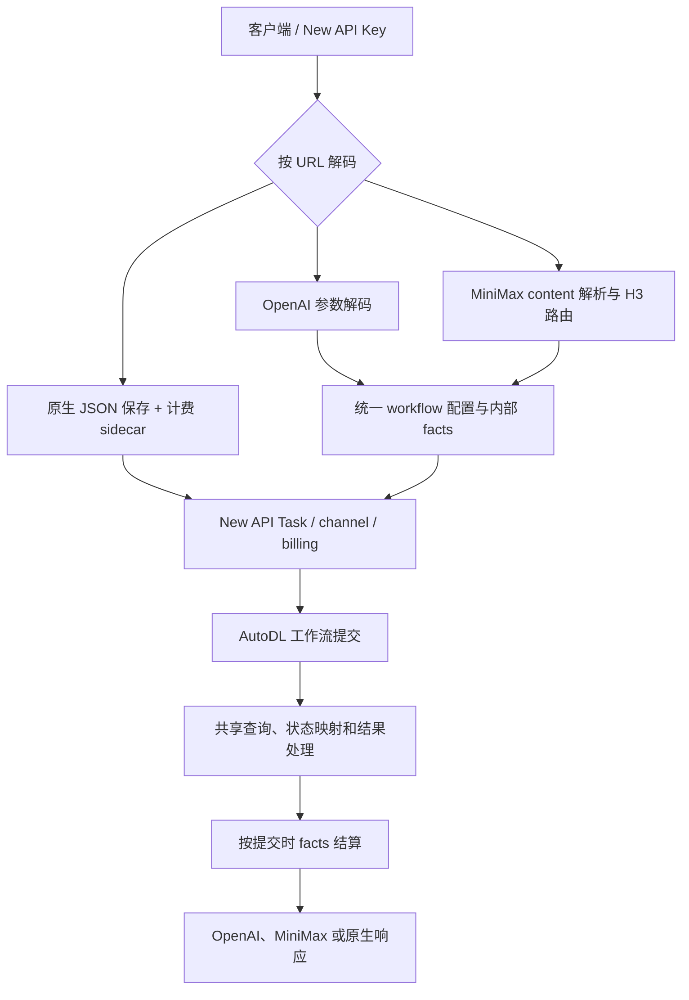

# AutoDL New API 插件 API 参考

本文面向调用插件的客户端开发者和 New API 管理员。插件版本固定为 `1.0.0`，工作流与价格快照分别见 [workflows.json](workflows.json) 和 [prices.json](prices.json)，可直接运行的三格式样例见 [examples.json](examples.json)。唯一安装源码仍是 [main/plugin.js Raw URL](https://raw.githubusercontent.com/yiyinfaith/new-api-plugin-autodl/main/plugin.js)。

## 目录

- [基本配置](#基本配置)
- [接口速查](#接口速查)
- [OpenAI Videos API](#openai-videos-api)
- [MiniMax 官方 V2 API](#minimax-官方-v2-api)
- [AutoDL ComfyUI 原生 API](#autodl-comfyui-原生-api)
- [工作流目录与能力边界](#工作流目录与能力边界)
- [错误、轮询和计费](#错误轮询和计费)
- [插件处理流程](#插件处理流程)

## 基本配置

在 New API 中安装并启用插件后，创建 **Task Plugin（61）** 渠道，插件选择显示名 **AutoDL**（插件 key 为 `autodl`），Base URL 填 `https://autodl.art`，密钥填写 AutoDL 的 **ComfyUI 分组 Token 原文**，不要加 `Bearer `。将需要使用的工作流 ID（以及 MiniMax 官方别名）加入该渠道模型列表，为这些模型配置价格和可访问分组，再启用渠道。完整 URL、宿主版本要求和 Cloudflare 提示见 [README 安装说明](README.md#url-安装)。

所有下面的客户端请求发往 New API 的根地址，例如 `https://api.example.com`，并使用 New API API Key：

```http
Authorization: Bearer <NEW_API_KEY>
Content-Type: application/json
```

插件从渠道读取 AutoDL Token，并以 `Authorization: <AUTODL_TOKEN>` 访问 AutoDL。不要把 AutoDL Token 放在调用方请求、插件源码或仓库中。参考图、音频、视频必须是任务处理期间可公开下载的 HTTP(S) URL。当前适配器不上传二进制文件、不支持 Base64/data URL 或 `file_id`。

## 接口速查

| 格式 | 创建 | 查询 | 成功结果 |
|---|---|---|---|
| OpenAI 视频 | `POST /v1/videos` | `GET /v1/videos/{task_id}` | `GET /v1/videos/{task_id}/content` 下载视频 |
| MiniMax V2 | `POST /v2/video_generation` | `GET /v2/query/video_generation/{task_id}` | `task.content.url` 是公开产物 URL |
| AutoDL 原生 ComfyUI | `POST /api/v1/comfyui/comfyui_workflow/{workflow_id}` | `GET /api/v1/comfyui/comfyui_workflow/result/{task_id}` | `results[]` 中的公开 URL |

三种格式都由 New API 鉴权、选择渠道、检查价格、管理公开 task ID 和轮询。路径选定请求解码方式；MiniMax workflow ID 是 `model` 的扩展值，仍用 MiniMax V2 路径。原生 body 不加入模型包装，模型由路径中的 workflow ID 确定。

## OpenAI Videos API

### 创建视频

`POST /v1/videos` 使用 OpenAI 风格 JSON；`model` 使用 AutoDL workflow ID。标准视频接口支持 16 个视频工作流。按具体工作流接受统一 `prompt`、`seconds`、`resolution`、`orientation`、`size`、媒体和种子参数。

```bash
curl -sS "$NEW_API_BASE_URL/v1/videos" \
  -H "Authorization: Bearer $NEW_API_KEY" \
  -H 'Content-Type: application/json' \
  -d '{"model":"minimax_h3_lightx2v_no_pic","prompt":"一只猫在雪地中奔跑","seconds":5,"size":"864x480"}'
```

成功时返回 New API 公开任务 ID，例如：

```json
{"id":"<task_id>","object":"video","status":"queued","created_at":1785125529}
```

字段由 New API 按 OpenAI Videos 响应模型提供；不要用 AutoDL 上游私有 task ID 轮询。

### 查询和下载

```bash
curl -sS "$NEW_API_BASE_URL/v1/videos/$TASK_ID" \
  -H "Authorization: Bearer $NEW_API_KEY"

curl -f "$NEW_API_BASE_URL/v1/videos/$TASK_ID/content" \
  -H "Authorization: Bearer $NEW_API_KEY" --output result.mp4
```

状态由宿主呈现；排队时为 `queued`，执行时为 `in_progress`，结束为 `completed` 或 `failed`。成功查询包含公开 `url` 和 `results`。`/content` 由 New API 验证任务归属并通过插件的 credentialless 内容钩子读取产物，不会把 AutoDL Token 发给 CDN。该模式的 `--artifact` 客户端选项只接受 `video`。

### OpenAI 参数

| 字段 | 类型 | 说明 |
|---|---|---|
| `model` | string | 必填；使用本表中的 AutoDL workflow ID，不接受 MiniMax 官方别名。 |
| `prompt` | string | 文本提示；按工作流长度校验。无文本输入的工作流不接受。 |
| `seconds` | integer 或数字字符串 | 统一秒数输入；映射到 `duration` 或 `audio_duration`。按工作流的整数范围校验。动作迁移和 TTS 不支持。 |
| `resolution` | string | 可选统一档位，例如 `480p`、`768p`、`1080p`。准确枚举依工作流而异。 |
| `orientation` | `portrait` / `landscape` / `square` | 可选方向，与工作流档位组合校验。 |
| `size` | string | 可选精确像素尺寸，如 `864x480`；只接受已核对尺寸，和 resolution/orientation 冲突时报错。 |
| `input_reference` | object 或 object[] | 图片对象为 `{"image_url":"https://…"}`。单图可用单对象；多图用对象数组，数组顺序决定首尾帧或 `ref_image_*` 顺序。 |
| `audios` | string[] | 公开音频 URL 数组，按顺序映射工作流音频槽位。 |
| `videos` | string[] | 公开视频 URL 数组；动作迁移使用 `videos[0]` 映射 `ref_video`。 |
| `seed` | integer | 按工作流提供的种子范围校验；不支持种子的工作流会拒绝。 |
| `emotion` | object | indexTTS2 专用情感控制；其他工作流拒绝。 |

参考图数量严格匹配工作流定义：文生视频不传 `input_reference`；单图工作流只能传 1 张；首尾帧工作流传 2 张，依序作为 first/last frame；多图工作流按顺序映射 `ref_image_*`。不自动补齐、截断或忽略。具体范围、默认值、枚举和尺寸见 [工作流目录](#工作流目录与能力边界)。

单图示例：

```json
{"model":"minimax_h3_lightx2v_v5","prompt":"人物向镜头微笑","seconds":5,"size":"768x1344","input_reference":{"image_url":"https://media.example.com/person.png"}}
```

首尾帧示例：

```json
{"model":"minimax_h3_lightx2v","prompt":"镜头平稳推进","seconds":5,"size":"864x480","input_reference":[{"image_url":"https://media.example.com/first.png"},{"image_url":"https://media.example.com/last.png"}]}
```

`input_reference` 对象数组是此适配器的扩展；不声称 OpenAI 官方 Videos API 支持多图。旧 `images` 字段、URL 字符串、字符串数组、`file_id`、额外引用对象属性和二进制上传都会报错。

## MiniMax 官方 V2 API

使用 MiniMax 官方路径与 `content` 请求体。外部模型可以是 `MiniMax-H3`、`MiniMax-H3-Max`，或 17 个 AutoDL workflow ID 中任意一个。别名 `MiniMax-H3-MAX` 也作为兼容输入接受，归一化为 `MiniMax-H3-Max`。这些模型都通过相同的 V2 路径，不需要额外 workflow 字段。

### 请求结构

`POST /v2/video_generation` 的基本 body：

```json
{
  "model":"MiniMax-H3",
  "content":[{"type":"text","text":"一只猫在雪地中奔跑"}],
  "resolution":"768P",
  "duration":5,
  "ratio":"16:9"
}
```

必填字段为 `model`、`content`、`resolution` 和 `duration`。官方别名还要求恰好一条非空 text，最多 7000 字符。`ratio` 按场景必需或可选。`seed`、`audio_duration` 和 AutoDL 特有工作流字段为扩展参数，仅当选中的工作流存在相应 `input_rules` 时接受；不得将 AutoDL 的 `duration` 和 `audio_duration` 混为一项。没有官方含义的顶层字段不会被静默接受。

`content` 项：

```json
[
  {"type":"text","text":"描述文字"},
  {"type":"image_url","image_url":{"url":"https://media.example.com/ref.png"},"role":"reference_image"},
  {"type":"audio_url","audio_url":{"url":"https://media.example.com/ref.wav"},"role":"reference_audio"}
]
```

`text` 最多一项。媒体资源对象只接受 `url`，值须为公开 HTTP(S) URL。未指定 image role 时按官方规则视为 `first_frame`；参考图请显式使用 `reference_image`。不允许首尾帧与参考媒体混用、重复 frame role 或超过工作流输入槽位。当前自动路由模型没有可用的 reference-video workflow，传 `reference_video` 会明确报错。

首尾帧请求将上面的媒体对象替换为两项 image：分别用 `role: "first_frame"` 和 `role: "last_frame"`。单帧、reference image、reference audio 和 reference video 的对象结构不变，只使用对应的 role；当前模型路由对 reference video 会明确拒绝。

### 官方模型约束和路由

别名路由使用 content 媒体、时长、resolution 和 ratio 决定 AutoDL workflow：

| `model` | 外部约束 | Content 条件 | 选定 workflow |
|---|---|---|---|
| `MiniMax-H3` | `resolution`: `768P` 或 `2K`；整数 `duration`: 4–15 秒 | 只有 text | `minimax_h3_z0901` |
| `MiniMax-H3` | 同上 | 成对 first_frame + last_frame | `minimax_h3_lightx2v` |
| `MiniMax-H3` | 同上 | 1–6 张图、无音频、非 1:1 | `minimax_h3_z0902` |
| `MiniMax-H3` | 同上 | 1–6 张图、带音频、非 1:1 | `minimax_h3_z0903` |
| `MiniMax-H3` | 同上 | 7–9 张图，或带图片的 1:1，可带音频 | `minimax_h3_zm_u24` |
| `MiniMax-H3-Max` | `resolution`: `480P` 或 `768P`；整数 `duration`: 5–15 秒 | 只有 text | `minimax_h3_lightx2v_no_pic` |
| `MiniMax-H3-Max` | 同上 | 成对 first_frame + last_frame | `minimax_h3_lightx2v` |
| `MiniMax-H3-Max` | 同上 | 图片、无音频，5–10 秒 | `minimax_h3_lightx2v_v5` |
| `MiniMax-H3-Max` | 同上 | 图片、无音频，11–15 秒 | `minimax_h3_lightx2v_v5_15s` |
| `MiniMax-H3-Max` | 同上 | 图片+音频，1:1，5–15 秒 | `minimax_h3_zm_u08` |
| `MiniMax-H3-Max` | 同上 | 图片+音频，非 1:1，5–10 秒 | `minimax_h3_image_audio_to_video_v2` |
| `MiniMax-H3-Max` | 同上 | 图片+音频，非 1:1，11–15 秒 | `minimax_h3_image_audio_to_video_v2_15s` |

`MiniMax-H3-MAX` 使用与 `MiniMax-H3-Max` 相同的规则。官方别名不会自动路由到 `minimax_h3_image_audio_to_video`。路由选择后还要通过目标工作流自身的媒体数量、resolution 和业务能力校验；无法满足时返回明确错误，不静默改变 duration 或降低分辨率。H3-Max 的 2K、低于 5 秒会按官方约束拒绝；H3 的 2K 如果目标工作流没有该分辨率，也会明确拒绝。

### 比例与 adaptive

接受 MiniMax 官方比例：`adaptive`、`21:9`、`16:9`、`4:3`、`1:1`、`3:4`、`9:16`。横向比例选择可用横屏档位，`3:4` / `9:16` 选择竖屏档位，`1:1` 优先选择方形档位。某 workflow 没有对应方向时会报不支持，比例映射不会改变其 resolution 档位。

纯文生视频必须给出具体 ratio，不能传 `adaptive`。图像/视频/音频参考场景允许省略 ratio，默认按 adaptive；首尾帧遵循 MiniMax adaptive 语义。插件仅为单文件，New API rc.41 Plugin API v1 不提供远程媒体尺寸探测能力，因此无法按图片真实宽高选择方向。遇到 adaptive 时会接受请求，并使用所选 AutoDL workflow 的官网默认方向作为最接近的降级；此行为不保证输出匹配参考图真实比例，也不是 MiniMax 服务端尺寸探测。

MiniMax resolution `480P`、`768P`、`2K` 分别映射为工作流 `480p`、`768p`、`1440p` 档位。直接传工作流 ID 时，AutoDL 特有分辨率可按工作流允许的原始名称扩展使用，例如 `1080p` 或完整横竖档位标签。

### 创建、查询和下载

```bash
curl -sS "$NEW_API_BASE_URL/v2/video_generation" \
  -H "Authorization: Bearer $NEW_API_KEY" \
  -H 'Content-Type: application/json' \
  -d '{"model":"MiniMax-H3","content":[{"type":"text","text":"一只猫在雪地中奔跑"}],"resolution":"768P","duration":5,"ratio":"16:9"}'

curl -sS "$NEW_API_BASE_URL/v2/query/video_generation/$TASK_ID" \
  -H "Authorization: Bearer $NEW_API_KEY"
```

创建成功返回 `{"task_id":"<New API 公开任务 ID>"}`。查询返回 MiniMax 风格 `{ "task": { ... } }`：状态为 `queued / running / succeeded / failed`；成功含 `task.content.url`；失败含 `task.error.code / message`。视频任务 `task.modality` 为 `video`，AutoDL 的 TTS 扩展任务则为 `audio`，可以用 `--artifact audio` 下载。

New API rc.41 的公开 TaskView 不包含所有私有插件 state；AutoDL 的 `data.duration` 表示处理耗时而不是成片秒数。因此查询只返回可确认的 ID、状态、时间和产物，省略不能确认的 model、resolution、duration、ratio、usage 和 token 用量。MiniMax 客户端若要求这些字段，不能用本适配器查询结果替代官方服务的完整元数据。插件也不实现 `file_id`、二进制上传和 `callback_url` 等其他服务能力。

直接使用 AutoDL workflow ID 时仍走相同路径和 MiniMax `content` 格式，例如将上例的 `model` 改成 `minimax_h3_z0901`。该模式按对应工作流能力处理，可使用 AutoDL 扩展 duration 范围、resolution、seed、audio_duration 等参数，不受官方别名 H3/H3-Max 的额外参数约束。

## AutoDL ComfyUI 原生 API

### 创建任务

```bash
curl -sS "$NEW_API_BASE_URL/api/v1/comfyui/comfyui_workflow/minimax_h3_lightx2v" \
  -H "Authorization: Bearer $NEW_API_KEY" \
  -H 'Content-Type: application/json' \
  -d '{"prompt":"镜头平稳推进","duration":5,"resolution":"480p竖","first_frame":"https://media.example.com/first.png","last_frame":"https://media.example.com/last.png"}'
```

URL 中的 workflow ID 决定模型。body 是该工作流官网定义的原生 JSON；例如 `prompt`、`duration`、`audio_duration`、`resolution`、`seed`、`first_frame`、`last_frame`、`ref_image_0`、`ref_audio_0`、`ref_video`、TTS `emo_*` 及未来未知扩展字段按用户原值透传。不要给 body 增加统一的 `model` 或计费包装。

原生模式为 **Native Body Passthrough + Sidecar Validation/Billing**：New API 解析 JSON 后，插件保存并发送原始 JSON 的语义内容，保持字段、未知字段、嵌套结构、数组顺序以及 number/string 类型；HTTP JSON 字节空白和对象键顺序不是稳定契约。插件不会写回 AutoDL 默认值。为了安全计费，它旁路检查该 workflow 声明的 `duration / audio_duration / resolution`：显式不支持或无法映射的计费字段会报错；省略时仅将官网默认用于内部 facts。未知业务字段由 AutoDL 校验，仍原样发送。任务 action 根据工作流类型以及 body 是否包含参考图/视频槽位判断。

body 必须是 JSON object，workflow ID 必须是插件注册的 17 个工作流之一。数字字符串可通过计费分析，并保留原字符串透传；其能否被 AutoDL 接受由上游决定。若 body 有 `__fileRef` 同名字段，它会作为普通原生 JSON 数据发送，不由 rc.41 递归展开成插件附件。原生接口仅用于官网 body；若要插件统一转换参数、严格映射媒体数量，请使用 OpenAI 或 MiniMax 格式。

成功提交返回 `task_id`，由 New API 管理和授权。

### 查询

```bash
curl -sS "$NEW_API_BASE_URL/api/v1/comfyui/comfyui_workflow/result/$TASK_ID" \
  -H "Authorization: Bearer $NEW_API_KEY"
```

返回 `{ "task_id", "status", "progress", "fail_reason", "results" }`。状态包括 `QUEUED`、`IN_PROGRESS`、`SUCCESS`、`FAILURE` 和 `UNKNOWN`。成功时 `results` 保留可用的公开媒体 URL 与 `type`，例如 `video` 或 `audio`；客户端直接下载 URL，不能转发 New API 或 AutoDL Token 到 CDN。

## 工作流目录与能力边界

| Workflow ID | 能力摘要 | 媒体范围 | duration / resolution 摘要 |
|---|---|---|---|
| `minimax_h3_z0903` | H3 多图+音频 | 图 1–6、音频 1–3 | 1–15 秒；480p/768p/1088p/1440p |
| `minimax_h3_z0902` | H3 多图 | 图 1–6 | 1–15 秒；480p/768p/1088p/1440p |
| `minimax_h3_z0901` | H3 文生视频 | 无媒体 | 1–15 秒；480p/768p/1088p/1440p |
| `minimax_h3_zm_u24` | H3 多图多音频升级版 | 图 1–9、音频 0–3 | 1–15 秒；480p/768p |
| `minimax_h3_zm_u08` | H3 多图多音频高速版 | 图 1–9、音频 0–3 | 1–15 秒；480p/768p |
| `minimax_h3_b99_002` | H3 首尾帧 | 图 2 | 1–15 秒；736p |
| `minimax_h3_b99_001` | H3 文生视频 | 无媒体 | 1–15 秒；736p |
| `minimax_h3_b99_003_12s` | H3 多图 12 秒 | 图 1–9 | 1–12 秒；736p |
| `wan2.2animate-v4-motion_retargeting` | 动作迁移 | 图 1、视频 1 | 不控制时长；832p/464p |
| `minimax_h3_image_audio_to_video_v2_15s` | H3 多图多音频 | 图 0–9、音频 0–3 | 1–15 秒；480p/768p |
| `minimax_h3_lightx2v_v5_15s` | H3 多图参考 | 图 1–9 | 1–15 秒；480p/768p |
| `minimax_h3_image_audio_to_video_v2` | H3 多图多音频 | 图 0–9、音频 0–3 | 1–10 秒；480p/768p/1080p |
| `minimax_h3_image_audio_to_video` | H3 单图音频同步 | 图 1、音频 1 | 1–15 秒(audio_duration)；480p/768p/1080p |
| `minimax_h3_lightx2v_v5` | H3 多图参考 | 图 1–9 | 1–10 秒；480p/768p/1080p |
| `minimax_h3_lightx2v_no_pic` | H3 文生视频 | 无媒体 | 1–15 秒；480p/768p |
| `minimax_h3_lightx2v` | H3 首尾帧 | 图 2 | 1–15 秒；480p/768p |
| `indextts2-v1` | indexTTS2 音频合成 | 音色参考 1–2；可选情感参考音频 | 时长由文本决定；无视频 resolution |

OpenAI Videos 模式不暴露 `indextts2-v1`。它可使用 MiniMax 音频扩展或 AutoDL 原生接口。动作迁移的视频时长跟随输入视频，TTS 没有生成视频秒数；不能传 `seconds` 计费。每项 workflow 的准确必需字段、默认值、完整原始 resolution 标签、数值上下限和 input_rules 以 [workflows.json](workflows.json) 为准。

MiniMax 官方别名受官方规则约束；例如 H3 duration 为 4–15、resolution 为 768P/2K，H3-Max duration 为 5–15、resolution 为 480P/768P。直接用 workflow ID 时，使用 AutoDL 对应规则，某些 workflow 可接受 1 秒或额外 resolution。自动路由无法匹配或选中的 AutoDL workflow 不支持请求配置时会报错，不猜测映射。

## 错误、轮询和计费

- 认证错误：确认调用方 `Authorization: Bearer <NEW_API_KEY>` 有效，并且已选择 AutoDL Task Plugin 渠道。
- 上游 401/403：核对渠道中的 AutoDL ComfyUI 分组 Token 原文，Token 不含 `Bearer `。
- 请求字段或媒体校验错误：检查模型 ID、JSON 类型、duration 范围、resolution、媒体公开可读性和媒体数量。OpenAI/MiniMax 的数量错误由插件明确拒绝；原生格式的实际媒体业务校验交给 AutoDL。
- `model_price_error` 或预扣失败：为对应 workflow ID 配置模型价格；官方别名 `MiniMax-H3` 和 `MiniMax-H3-Max` 也需要可用于该渠道的价格规则。
- 404/410：核对 task ID 是否为 New API 返回的公开 ID；不要使用上游私有 ID。
- 429 和 5xx：处理限流或服务暂时错误，遵守客户端截止时间和退避策略。插件轮询最长约 30 分钟；超时只表示插件停止等待，上游任务可能仍在运行。
- `SUCCESS` 缺少预期类型的产物时，任务会以失败原因结束；插件不把图片预览误当视频，也不把无类型音频默认当视频。

当前价格快照和来源列于 [prices.json](prices.json)。以下 7 个 workflow 已核实官网定价：`minimax_h3_lightx2v_no_pic`、`minimax_h3_lightx2v_v5`、`minimax_h3_lightx2v`、`minimax_h3_image_audio_to_video_v2`、`minimax_h3_image_audio_to_video`、`minimax_h3_image_audio_to_video_v2_15s`、`minimax_h3_lightx2v_v5_15s`。其他 10 个 workflow 和两个官方 MiniMax 模型别名目前没有仓库提供的默认价格。管理员需按自己的成本和站点策略补齐价格后才能正常调用。插件安装不会改价格；不要把不同 AutoDL workflow 的价格或 alias 的内部路由价格自行假定为相同。

## 插件处理流程



只有参数解码和最终响应形状依 API 格式不同。提交、AutoDL 上游路径、轮询、状态映射、任务数据、按请求事实结算和产物下载共用插件底层逻辑。新工作流由插件内的 `WORKFLOWS` 配置驱动；开发目录中的 JSON 文件仅用于文档、示例和验证，不是 Raw URL 安装的运行依赖。
