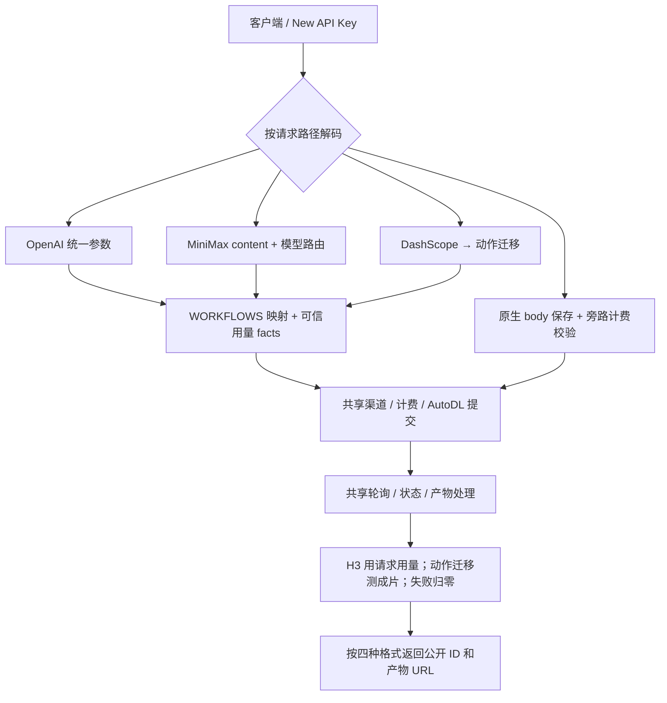

# AutoDL New API 插件 API 参考

版本 **1.0.0**。四套接口的参数、示例、响应与计费规则均在本文件；示例地址需替换为真实媒体。

[配置](#基本配置) · [接口](#接口速查) · [输入媒体](#输入媒体url-与-data-url) · [OpenAI](#openai-videos-api) · [MiniMax](#minimax-官方-v2-api) · [AutoDL 原生](#autodl-comfyui-原生-api) · [DashScope](#阿里云百炼--dashscope-wan-api) · [工作流参数](#工作流目录与能力边界) · [动作迁移](#动作迁移与-wan22-animate-move-渠道别名) · [错误与计费](#错误轮询和计费)

## 基本配置

「任务插件 → 从 URL 导入」安装并启用 **AutoDL**（key `autodl`）：`https://raw.githubusercontent.com/yiyinfaith/new-api-plugin-autodl/main/plugin.js`。仅此文件即可运行，无仓库文件依赖；仓库首页不能作为源码 URL。

渠道选择 **Task Plugin（61）→ AutoDL**；Base URL `https://autodl.art`，不加 API 路径；密钥为 **AutoDL ComfyUI 分组 Token 原文，不加 Bearer**。加入要调用的模型，配置价格、分组权限并启用；安装不自动配置这些项。

已验证 **New API v1.0.0-rc.42**：宿主需有 Plugin API v1、usageProfiles、openai_video、credentialless 下载，并精确放行下表四条 `/api` 路由，否则报 `intersects reserved namespace /api`。动作迁移还需更新后的 video-duration@1 与 ffprobe（构建、运行环境安装 FFmpeg）。缺少宿主能力需补齐并重建；其他版本需核对适用性。

rc.42 用 Root 安装，浏览器需可访问 Raw URL。同 key/版本、不同源码报 `plugin key and version already exist with different source`；更新时备份、暂停渠道并等在途任务结束，按后台提示删除旧安装、从同一 URL 导入启用后恢复渠道。

客户端用 **New API 根地址与 Key**，不传 AutoDL Token。curl 共用以下变量；request.json 保存所选接口的 body，其他 POST 替换路径，GET 仅保留 Authorization：

```bash
export NEW_API_BASE_URL="https://api.example.com"
export NEW_API_KEY="<NEW_API_KEY>"
curl "$NEW_API_BASE_URL/v1/videos" \
  -H "Authorization: Bearer $NEW_API_KEY" -H 'Content-Type: application/json' \
  --data-binary @request.json
```

## 接口速查

| 格式 | 创建（POST） | 查询（GET） | 成功产物 |
|---|---|---|---|
| OpenAI | `/v1/videos` | `/v1/videos/{task_id}` | `url / results`；`GET /v1/videos/{task_id}/content` 下载视频 |
| MiniMax V2 | `/v2/video_generation` | `/v2/query/video_generation/{task_id}` | `task.content.url` |
| AutoDL 原生 | `/api/v1/comfyui/comfyui_workflow/{workflow_id}` | `/api/v1/comfyui/comfyui_workflow/result/{task_id}` | `results[].url` |
| DashScope Wan | `/api/v1/services/aigc/image2video/video-synthesis` | `/api/v1/tasks/{task_id}` | `output.results.video_url` |

路径决定格式。宿主检查密钥、归属、渠道和价格；始终用创建返回的 **New API 公开 task ID** 查询，不用上游私有 ID。

## 输入媒体：URL 与 Data URL

| 格式 | 图片 | 音频 | 视频 |
|---|---|---|---|
| OpenAI | `input_reference.image_url`；多图为对象数组 | `audios[]` | `videos[]` |
| MiniMax | `content[].image_url.url` | `content[].audio_url.url` | `content[].video_url.url` |
| AutoDL 原生 | 工作流的 `first_frame / last_frame / ref_image / ref_image_*` | `ref_audio_* / prompt_simple / emo_ref_audio` | `ref_video` |
| DashScope | `input.image_url` | 无音频字段 | `input.video_url` |

以上字段接受 **公网 HTTP(S) URL 或标准 Data URL**，可混用，数量按工作流。Data URL 如 `data:image/png;base64,...`、`data:audio/wav;base64,...`、`data:video/mp4;base64,...`：MIME 类别匹配字段，Base64 非空、标准字母表、补位及位值正确。拒绝裸 Base64、百分号编码、换行、额外 charset、文件路径、file_id、二进制上传；URL 在任务期间须公开可读。

Data URL 是适配器扩展；实际编码/尺寸/内容由上游校验。官网接受图片 JPEG/PNG/WebP，H3 音频 MPEG/WAV/FLAC（image_audio_to_video* 另可 MP4），TTS MPEG/WAV，动作迁移视频 MP4/WebM。插件仅检查 MIME 类别与输入格式。

从真实文件生成 Data URL，再填入同一个媒体字段：

```python
import base64
from pathlib import Path
def data_url(path, mime):
    return f"data:{mime};base64," + base64.b64encode(Path(path).read_bytes()).decode("ascii")
image = data_url("person.png", "image/png")
audio = data_url("reference.wav", "audio/wav")
video = data_url("motion.mp4", "video/mp4")
```

**输出只返回公网 URL**；四接口 URL/Data URL 输入已付费验证。内联输入受宿主请求体/JS 资源限制，大文件优先 URL；动作迁移另受[视频测量限制](#动作迁移与-wan22-animate-move-渠道别名)。

## OpenAI Videos API

### 请求参数

`POST /v1/videos` 支持 16 个视频 workflow ID；不提供官方 MiniMax 别名或 TTS。范围、默认、必需媒体与尺寸见[本文件参数表](#工作流目录与能力边界)。

| 字段 | 类型 | 规则 |
|---|---|---|
| `model` | string，必需 | AutoDL workflow ID；渠道映射后的动作迁移别名也可用。 |
| `prompt` | string | 有文本槽位时必需、非空，按工作流长度限制；无文本槽位时拒绝。 |
| `seconds` | integer 或数字字符串 | 映射 `duration` 或 `audio_duration`，省略默认 5；按工作流范围校验。动作迁移不接受。 |
| `resolution` | string | 统一档位，如 `480p / 768p / 1080p`；省略用工作流默认。 |
| `orientation` | string | `portrait / landscape / square`；省略用默认方向，组合必须有对应档位。 |
| `size` | string | 精确 `宽x高`；仅接受已确认尺寸，与 resolution/orientation 冲突报错。 |
| `input_reference` | object 或 object[] | 每个对象只能有字符串 `image_url`；单图 `{"image_url":"https://…"}`，多图为同类对象数组。 |
| `audios` / `videos` | string[] | 按数组顺序填入对应音频/视频槽位，值接受 URL/Data URL。 |
| `seed` | integer 或数字字符串 | 按工作流种子范围校验；没有 seed 能力时拒绝。 |

参考图：文生不传；单图恰好 1 张；首尾帧 2 张、依序 first_frame/last_frame；多图依序 ref_image_*。数量不符报错，不补齐/截断/忽略。对象数组是扩展；拒绝旧 images、引用字符串/字符串数组、额外对象属性和未知字段。emotion 仅属内部 TTS 控制，视频工作流拒绝。

文本表单：input_reference 用 JSON 对象/数组，或重复同名字段、每项 JSON 对象；audios/videos/emotion 用 JSON 编码。仅 minimax_h3_lightx2v_no_pic 保留旧 duration 和原生 resolution 标签；与 seconds/orientation 冲突报错。

### 请求示例

文生视频（body 保存为 `request.json`，用前面的 curl 提交）：

```json
{"model":"minimax_h3_lightx2v_no_pic","prompt":"一只猫在雪地中奔跑","seconds":5,"size":"864x480"}
```

单图；多图使用下面首尾帧示例的对象数组结构，并选择多图 workflow：

```json
{"model":"minimax_h3_lightx2v_v5","prompt":"人物向镜头微笑","seconds":5,"size":"768x1344","input_reference":{"image_url":"https://media.example.com/person.png"}}
```

首尾帧：

```json
{
  "model":"minimax_h3_lightx2v", "prompt":"镜头平稳推进", "seconds":5, "size":"864x480",
  "input_reference":[{"image_url":"https://media.example.com/first.png"},{"image_url":"https://media.example.com/last.png"}]
}
```

### 查询和下载

创建：`{"id":"<task_id>","object":"video","status":"queued","created_at":1785125529}`。查询状态 queued/in_progress/completed/failed，成功含 url/results；ID、状态及时间由宿主生成。

```bash
curl "$NEW_API_BASE_URL/v1/videos/$TASK_ID" -H "Authorization: Bearer $NEW_API_KEY"
curl -f "$NEW_API_BASE_URL/v1/videos/$TASK_ID/content" \
  -H "Authorization: Bearer $NEW_API_KEY" --output result.mp4
```

`/content` 验证归属，支持 GET/HEAD/安全 Range；以 credentialless GET 取签名产物，客户端 HEAD 仅返回头，不转发渠道密钥。这里只下载 video。

## MiniMax 官方 V2 API

> **AutoDL 官网全部 17 个 workflow ID 也支持 MiniMax 格式，与 MiniMax-H3 / MiniMax-H3-Max 并列；创建统一 POST /v2/video_generation，查询统一 GET /v2/query/video_generation/{task_id}。**

| `model` | 执行与校验 |
|---|---|
| **AutoDL workflow ID**，如 `minimax_h3_z0901 / minimax_h3_lightx2v / minimax_h3_zm_u08` | 固定执行指定工作流，按其能力校验；保留 1 秒、扩展分辨率、音频与动作迁移能力。 |
| **`MiniMax-H3` / `MiniMax-H3-Max`** | 先按官方模型范围校验，再自动选择并校验 AutoDL 工作流；无需额外 `workflow_id`。 |

MiniMax-H3-MAX 是 MiniMax-H3-Max 的兼容别名。渠道配置请求 model 与价格；workflow ID 使用官网 ID。

### 请求结构

| 字段 | 类型 | 规则 |
|---|---|---|
| `model` | string，必需 | 上述官方模型名或任意已注册 workflow ID。 |
| `content` | object[]，必需 | 下表定义的文本/媒体项；最多 1 项 text。 |
| `resolution` | string | 有分辨率控制时必需；官方命名 `480P→480p`、`768P→768p`、`2K→1440p`。 |
| `duration` | integer | 官方模型名必需；直接 ID 按该工作流 `duration` 范围，省略默认 5。 |
| `audio_duration` | integer 或数字字符串 | 仅存在此字段的工作流可用，省略默认 5；不与 duration 互换。 |
| `ratio` | string | 规则见[比例与 adaptive](#比例与-adaptive)。 |
| `seed` | integer 或数字字符串 | 仅支持种子的工作流接受，范围见参数表。 |
| 工作流扩展字段 | 对应类型 | 可用该工作流的非文本、非媒体原生控制，如 TTS `emo_*`；不混入 prompt 或媒体槽位字段。 |

官方模型须 1 条非空 text、≤7000 字符；直接 ID 按工作流文本上限，duration 另可数字字符串。无 duration 控制则拒绝，TTS 也拒绝 resolution/ratio；未知字段（callback_url/extra 等）拒绝。

| `content[].type` | 内容 | `role` 与映射 |
|---|---|---|
| `text` | `"text":"描述"` | 不传 role；映射 `prompt / prompt_text`。 |
| `image_url` | `"image_url":{"url":"https://…"}` | `first_frame / last_frame` 对应帧；省略 role 默认 first_frame；`reference_image` 按顺序填图片槽位。 |
| `audio_url` | `"audio_url":{"url":"https://…"}` | 必须 `reference_audio`，按同类项出现顺序填音频槽位。 |
| `video_url` | `"video_url":{"url":"https://…"}` | 必须 `reference_video`；仅直接指定有视频输入能力的工作流可用。 |

资源对象只有字符串 url（URL/Data URL）；role 不能当 type，MiniMax url 不能换成 OpenAI image_url 结构。首尾帧不与参考媒体混用、不重复 frame role；数量按工作流，首尾帧工作流必须用对应两种 role。

### AutoDL 官网工作流模型名：直接使用 MiniMax 格式

**直接填 workflow ID，固定执行该工作流，使用相同 V2 路径、content 和响应。** 文生、多图+音频、首尾帧示例如下；三个 b99_*、音频同步、动作迁移、TTS 等全部 ID 的字段/范围/默认值见[本文件参数表](#工作流目录与能力边界)。

```json
{"model":"minimax_h3_z0901","content":[{"type":"text","text":"一只猫在雪地中奔跑"}],"resolution":"768P","duration":5,"ratio":"16:9"}
```

```json
{
  "model":"minimax_h3_zm_u08", "resolution":"768P", "duration":5, "ratio":"1:1", "seed":123,
  "content":[
    {"type":"text","text":"人物面向镜头说话，保留参考人物外观"},
    {"type":"image_url","role":"reference_image","image_url":{"url":"https://media.example.com/person.png"}},
    {"type":"image_url","role":"reference_image","image_url":{"url":"https://media.example.com/scene.png"}},
    {"type":"audio_url","role":"reference_audio","audio_url":{"url":"https://media.example.com/speech.wav"}}
  ]
}
```

```json
{
  "model":"minimax_h3_lightx2v", "resolution":"480P", "duration":5, "ratio":"adaptive",
  "content":[
    {"type":"text","text":"镜头平稳推进"},
    {"type":"image_url","role":"first_frame","image_url":{"url":"https://media.example.com/first.png"}},
    {"type":"image_url","role":"last_frame","image_url":{"url":"https://media.example.com/last.png"}}
  ]
}
```

直接 ID 按 AutoDL 能力保留 1 秒和扩展档位（736p/1080p/1088p/464p/832p）及完整原生标签；官方对应档位写 480P/768P/2K，不写裸 480p/768p/1440p。能力不符报错。minimax_h3_image_audio_to_video 用 audio_duration、1 图+1 音频、不传 text/duration，且不参与官方模型路由。

### 官方模型约束和路由

`MiniMax-H3`：resolution 仅 **768P / 2K**，整数 duration **4–15**；`MiniMax-H3-Max`：仅 **480P / 768P**、**5–15**。二者参考上限为 9 图、3 音频，首尾帧必须成对；只有音频、单个首/尾帧或 reference_video 都没有对应自动路由，明确报错。

| 官方 model | content / duration / ratio 条件 | AutoDL workflow |
|---|---|---|
| MiniMax-H3 | 仅 text | `minimax_h3_z0901` |
| MiniMax-H3 | 成对 first_frame + last_frame | `minimax_h3_lightx2v` |
| MiniMax-H3 | 1–6 图、无音频、非 1:1 | `minimax_h3_z0902` |
| MiniMax-H3 | 1–6 图+音频、非 1:1 | `minimax_h3_z0903` |
| MiniMax-H3 | 7–9 图，或有图且 1:1；均可带音频 | `minimax_h3_zm_u24` |
| MiniMax-H3-Max | 仅 text | `minimax_h3_lightx2v_no_pic` |
| MiniMax-H3-Max | 成对 first_frame + last_frame | `minimax_h3_lightx2v` |
| MiniMax-H3-Max | 图、无音频，5–10 秒 / 11–15 秒 | `minimax_h3_lightx2v_v5` / `minimax_h3_lightx2v_v5_15s` |
| MiniMax-H3-Max | 图+音频、1:1，5–15 秒 | `minimax_h3_zm_u08` |
| MiniMax-H3-Max | 图+音频、非 1:1，5–10 秒 / 11–15 秒 | `minimax_h3_image_audio_to_video_v2` / `minimax_h3_image_audio_to_video_v2_15s` |

目标能力不足报错，不改时长/降低档位，如 H3 首尾帧 2K、Max 2K 或小于 5 秒。reference_video 报「当前 AutoDL 适配器没有对应的 reference_video workflow」。

官方模型示例（均提交到 `/v2/video_generation`）：

```json
{"model":"MiniMax-H3","content":[{"type":"text","text":"一只猫在雪地中奔跑"}],"resolution":"768P","duration":5,"ratio":"16:9"}
```

```json
{"model":"MiniMax-H3-Max","content":[{"type":"text","text":"海边日落"}],"resolution":"480P","duration":5,"ratio":"16:9"}
```

### 比例与 adaptive

ratio 可用 adaptive/21:9/16:9/4:3/1:1/3:4/9:16：横向映横，3:4/9:16 映竖，1:1 优先方、无方退官网默认方向。无对应横/竖时报错，不改 resolution 档位，不保证精确 21:9/4:3。

纯文生必传具体 ratio、拒绝 adaptive；参考媒体可省略，默认 adaptive；首尾帧任何合法 ratio 均按 adaptive。插件不测媒体尺寸，adaptive 用官网默认方向（均为竖），不保证匹配输入比例。原生标签与具体 ratio 方向冲突报错；省略/adaptive/首尾帧仍选默认方向。

### 创建、查询和下载

创建 `{"task_id":"<task_id>"}`；查询 task 状态 queued/running/succeeded/failed/cancelled（UNKNOWN→running）。运行无 content，成功 content.url，失败 error；时间仅宿主提供时返回。

```json
{"task":{"id":"<task_id>","status":"succeeded","task_type":"generation","modality":"video","created_at":1785125529,"updated_at":1785125589,"content":{"url":"https://media.example.com/result.mp4"}}}
```

```json
{"task":{"id":"<task_id>","status":"failed","task_type":"generation","modality":"video","error":{"code":"video_generation_failed","message":"上游失败原因"}}}
```

成功优先视频，TTS 为 audio（modality/artifact）。不伪造宿主无法确认的 model/resolution/duration/ratio/usage/token；data.duration 是运行耗时。提供创建/轮询/下载，未实现完整官方服务能力；HTTP 参数错误沿用宿主结构。

### TTS 音频扩展

`indextts2-v1` 使用 MiniMax content 音频扩展或原生 body，不使用官方视频别名，不传 duration/resolution/ratio。text 映射 prompt_text（1–2048 字符），第 1 条 reference_audio→必需 prompt_simple（音色），第 2 条→可选 emo_ref_audio（情感），共 1–2 段。

```json
{"model":"indextts2-v1","content":[{"type":"text","text":"你好，这是音色参考合成示例。"},{"type":"audio_url","role":"reference_audio","audio_url":{"url":"https://media.example.com/voice.wav"}}],"emo_control_method":"与音色参考音频相同"}
```

| 扩展字段 | 类型 / 默认 | 规则 |
|---|---|---|
| `emo_control_method` | enum / 与音色参考音频相同 | 另可选「使用情感参考音频」（需第二音频）或「使用情感向量控制」。 |
| `emo_afraid / emo_angry / emo_calm / emo_disgusted / emo_happy / emo_melancholic / emo_sad` | number / 0 | 每项 0–1.4。 |
| `emo_random` | boolean / false | 随机情感开关。 |
| `emo_surprised` | enum / `"0"` | 仅 `"0"`；另兼容官网样例的数字 0。 |

不使用 emotion 包装。内部 emotion.mode 为 voice（默认）/reference（需第二音频）/vector，对应表中三种控制；random 为 boolean，七项数值范围同表，surprised=0 转字符串。OpenAI 入口不公开 TTS。

## AutoDL ComfyUI 原生 API

`POST /api/v1/comfyui/comfyui_workflow/{workflow_id}`：17 个注册工作流、JSON object，模型取路径，body 用官网字段，不加 model/计费包装。首尾帧例：

```json
{"prompt":"镜头平稳推进","duration":5,"resolution":"480p竖","first_frame":"https://media.example.com/first.png","last_frame":"https://media.example.com/last.png"}
```

**Native Body Passthrough + Sidecar Validation/Billing**：保留字段（含未知字段）、嵌套/数组及 number/string 类型，不保证空白/键顺序，不补默认。仅旁路检查 duration/audio_duration/resolution；不能安全计费则拒绝，省略用默认生成内部 facts。已知媒体字符串校验 URL/Data URL 后原样发送，数量/业务内容/数字字符串可用性由上游校验。__fileRef 当普通 JSON、不展开附件；action 由工作流及媒体槽位决定。

创建返回 task_id；查询 `GET /api/v1/comfyui/comfyui_workflow/result/{task_id}` 返回：

```json
{"task_id":"<task_id>","status":"SUCCESS","progress":"100%","fail_reason":"","results":[{"url":"https://media.example.com/result.mp4","type":"video"}]}
```

状态 NOT_START/SUBMITTED/QUEUED/IN_PROGRESS/SUCCESS/FAILURE/UNKNOWN/CANCELLED；非成功 results 空，失败 fail_reason。成功保留产物类型与 URL；body 透传不等于响应/ID 透传。

TTS 等价 body（POST 到同一原生创建前缀下的 `indextts2-v1`，参数规则见上面的 TTS 表）：

```json
{"prompt_text":"你好，这是音色参考合成示例。","prompt_simple":"https://media.example.com/voice.wav","emo_control_method":"与音色参考音频相同"}
```

查询路径不变，results[].type 为 audio；原生业务校验仍交给 AutoDL。

## 阿里云百炼 / DashScope Wan API

仅 **wan2.2-animate-move**，自动映射 wan2.2animate-v4-motion_retargeting（动作迁移）；这是 Wan，未提供 Qwen 模型。换 Base URL/Key，渠道配置外部 model/价格/权限，无需手工映射。

```bash
curl "$NEW_API_BASE_URL/api/v1/services/aigc/image2video/video-synthesis" \
  -H "Authorization: Bearer $NEW_API_KEY" -H 'Content-Type: application/json' \
  -H 'X-DashScope-Async: enable' \
  -d '{"model":"wan2.2-animate-move","input":{"image_url":"https://media.example.com/person.png","video_url":"https://media.example.com/motion.mp4","watermark":false},"parameters":{"mode":"wan-std","check_image":true}}'
```

| 字段 | 类型 | 规则 |
|---|---|---|
| `model` | string，必需 | 仅 wan2.2-animate-move。 |
| `input` / `parameters` | object，必需 | 仅接受本表子字段，所有层级拒绝未知字段。 |
| `input.image_url` / `input.video_url` | string，必需 | 图片/视频 URL 或对应 Data URL→ref_image/ref_video；各 1 个，无音频字段。 |
| `input.watermark` | boolean，可选 | 只能 false 或省略；上游没有水印控制。 |
| `parameters.mode` | string，必需 | 仅 wan-std；wan-pro 无等价工作流，明确拒绝。 |
| `parameters.check_image` | boolean，可选 | 只能 true 或省略；上游不能关闭图片检查，此兼容值不发送上游。 |

固定 body `{"resolution":"464*832px(竖版)","ref_image":"<图片>","ref_video":"<视频>"}`；不测图片尺寸、不加外部分辨率/时长/原生字段，wan-std 不保证官方服务质量。拒绝非法媒体、本地地址、facts/rewriteModel/私有 marker；视频抓取遵循宿主 DNS/重定向 SSRF 校验。

创建响应：`{"output":{"task_status":"PENDING","task_id":"<task_id>"},"request_id":""}`。GET `/api/v1/tasks/{task_id}` 查询，状态映射如下：

| 宿主状态 | DashScope task_status |
|---|---|
| NOT_START / SUBMITTED / QUEUED | PENDING |
| IN_PROGRESS | RUNNING |
| SUCCESS / FAILURE / CANCELLED | SUCCEEDED / FAILED / CANCELED |
| UNKNOWN 或其他 | UNKNOWN |

```json
{"request_id":"","output":{"task_id":"<task_id>","task_status":"SUCCEEDED","results":{"video_url":"https://media.example.com/result.mp4"}}}
```

```json
{"request_id":"","output":{"task_id":"<task_id>","task_status":"FAILED","code":"GenerationFailed","message":"真实失败原因"}}
```

运行无 results，URL 保留签名，失败用通用 GenerationFailed。rc.42 不暴露请求头，客户端应发 X-DashScope-Async: enable、插件无法强制检查。request_id 无安全值而为空；省略无法确认的 usage.video_duration/video_ratio，不用输入/处理时长冒充成片。共享动作迁移计费，未实现完整 DashScope 服务。

## 工作流目录与能力边界

**17 个工作流**，官网定义于 2026-10-08 复核。媒体数量严格校验仅用于 OpenAI/MiniMax，原生业务交上游。通常图片依序 ref_image_0…N、音频 ref_audio_0…N；首尾帧为 first_frame/last_frame；动作迁移 ref_image/ref_video；TTS prompt_simple/emo_ref_audio。H3 文本为必需非空 prompt，TTS 为 prompt_text；表中给最大字符数。可控时长是整数、默认 **5 秒**；无时长则拒绝。

| Workflow ID / 官网名称 | 媒体数量 | 时长字段 / 范围 | 分辨率组 | 文本上限 | 默认 seed |
|---|---|---|---|---|---|
| `minimax_h3_z0903`<br>H3六图三音频生视频（高质量音画融合） | 图 1–6；音 1–3 | `duration` 1–15 | A | ≤10000 | `757947932117433` |
| `minimax_h3_z0902`<br>H3六图生视频（多图一致性创作） | 图 1–6 | `duration` 1–15 | A | ≤10000 | `629515677062289` |
| `minimax_h3_z0901`<br>H3文生视频（高质量创意直出） | 无媒体 | `duration` 1–15 | B | ≤10000 | `865339729647738` |
| `minimax_h3_zm_u24`<br>H3多图多音频生视频(升级画质) | 图 1–9；音 0–3 | `duration` 1–15 | C | ≤10000 | `683072603085674` |
| `minimax_h3_zm_u08`<br>H3多图多音频生视频(高速版) | 图 1–9；音 0–3 | `duration` 1–15 | C | ≤10000 | `806661161901022` |
| `minimax_h3_b99_002`<br>H3首尾帧生成视频 | 图 2 | `duration` 1–15 | D | ≤10000 | `865339729647738` |
| `minimax_h3_b99_001`<br>H3文生视频 | 无媒体 | `duration` 1–15 | D | ≤10000 | `865339729647738` |
| `minimax_h3_b99_003_12s`<br>H3多图生视频12秒 | 图 1–9 | `duration` 1–12 | D | ≤10000 | `865339729647738` |
| `wan2.2animate-v4-motion_retargeting`<br>动作迁移 | 图 1；视频 1 | 无 | E | 无 | `485581468409274` |
| `minimax_h3_image_audio_to_video_v2_15s`<br>H3多图多音频生视频15秒 | 图 0–9；音 0–3 | `duration` 1–15 | F | ≤10000 | `731242627237534` |
| `minimax_h3_lightx2v_v5_15s`<br>H3多图生视频15秒 | 图 1–9 | `duration` 1–15 | G | ≤500000 | `212238359716024` |
| `minimax_h3_image_audio_to_video_v2`<br>H3多图多音频生视频 | 图 0–9；音 0–3 | `duration` 1–10 | H | ≤10000 | `731242627237534` |
| `minimax_h3_image_audio_to_video`<br>H3图生视频-音频同步(自动对口型) | 图 1；音 1 | `audio_duration` 1–15 | H | 无 | 无 |
| `minimax_h3_lightx2v_v5`<br>H3多图参考生视频 | 图 1–9 | `duration` 1–10 | I | ≤500000 | `212238359716024` |
| `minimax_h3_lightx2v_no_pic`<br>H3文生视频 | 无媒体 | `duration` 1–15 | G | ≤200000 | 无 |
| `minimax_h3_lightx2v`<br>H3首尾帧生成视频 | 图 2 | `duration` 1–15 | G | ≤2000000 | `479044338007328` |
| `indextts2-v1`<br>indextts2 | 音 1–2 | 无 | — | ≤2048 | 无 |

### 分辨率、方向与精确 size

| 组 | 档位及可用方向 | 官网默认原生 resolution | 精确 size |
|---|---|---|---|
| A | `480p` / `768p` / `1088p` / `1440p`；竖/横 | `768p竖(768*1376)` | 支持 |
| B | `480p` / `768p` / `1088p` / `1440p`；竖/横 | `768p竖(768*1344)` | 支持 |
| C | `480p` / `768p`；横/竖/方 | `768p竖` | 不支持 |
| D | `736p`；竖/横/方 | `736p竖` | 不支持 |
| E | `832p` 竖（`464*832px(竖版)`）；`464p` 横（`832*464px(横版)`） | `464*832px(竖版)` | 不支持 |
| F | `480p` / `768p`；竖/横 | `768p竖` | 支持 |
| G | `480p` / `768p`；竖/横/方 | `768p竖` | 支持 |
| H | `480p` / `768p` / `1080p`；竖/横 | `768p竖` | 支持 |
| I | `480p` / `768p` / `1080p`；竖/横/方 | `768p竖` | 支持 |

A/B 原生标签为 `档位竖(宽*高) / 档位横(宽*高)`，如 `768p竖(768*1376)`；C/D/F/G/H/I 为 `档位竖 / 档位横 / 档位(1:1)`，按可用方向组合；E 仅表中完整标签。MiniMax 仍按 ratio 选方向；OpenAI 用统一档位/orientation。

精确 size 如下；方形限 G/I 可用档位；C/D/E 用 resolution/orientation。1280x720 不在枚举内。

| 组 | 档位 | portrait size | landscape size | square size（组） |
|---|---|---|---|---|
| A/B/F/G/H/I | 480p | `480x864` | `864x480` | `480x480`（G/I） |
| A | 768p | `768x1376` | `1376x768` | — |
| A/B | 1088p | `1088x1920` | `1920x1088` | — |
| A/B | 1440p | `1440x2560` | `2560x1440` | — |
| B/F/G/H/I | 768p | `768x1344` | `1344x768` | `768x768`（G/I） |
| H/I | 1080p | `1080x1920` | `1920x1080` | `1080x1080`（I） |

相同档位不保证不同工作流宽高相同。动作迁移官网标签为 464×832 / 832×464，但节点值出现 468/832，因此不承诺其精确 size。

seed 上限 **999999999999999**，下限 **1**（zm_u24/zm_u08 为 **0**），默认值见工作流表；省略 seed 不补写上游 body。no_pic、image_audio_to_video、TTS 没有统一 seed 控制。

## 动作迁移与 wan2.2-animate-move 渠道别名

`wan2.2animate-v4-motion_retargeting`（动作迁移）：1 图+1 视频，不传 prompt/text/seconds/duration/audio_duration。OpenAI 可用实际 ID 或渠道映射的 wan2.2-animate-move；DashScope 自动映射该外部 model；MiniMax/原生用实际 ID。渠道需允许请求模型。

OpenAI（此例用实际 ID；改用 wan2.2-animate-move 时须先配置上述渠道映射）：

```json
{"model":"wan2.2animate-v4-motion_retargeting","input_reference":{"image_url":"https://media.example.com/person.png"},"videos":["https://media.example.com/motion.mp4"]}
```

MiniMax（提交到 `/v2/video_generation`）：

```json
{"model":"wan2.2animate-v4-motion_retargeting","resolution":"832p","ratio":"9:16","content":[{"type":"image_url","role":"reference_image","image_url":{"url":"https://media.example.com/person.png"}},{"type":"video_url","role":"reference_video","video_url":{"url":"https://media.example.com/motion.mp4"}}]}
```

原生：POST `/api/v1/comfyui/comfyui_workflow/wan2.2animate-v4-motion_retargeting`，body `{"ref_image":"https://media.example.com/person.png","ref_video":"https://media.example.com/motion.mp4"}`。DashScope 请求见其专用章节。

**video-duration@1 + ffprobe**：测参考视频预扣，成功后测视频轨道实秒、补扣/退差额，失败归零。输入 MP4/WebM 的 URL 或 Data URL：文件/解码后≤**256 MiB**、总测量≤**45 秒**、**0 < 时长 ≤ 3600 秒**。输入不可读/测量则付费前拒绝，输出暂不可测则轮询重试；遵守 SSRF、不转发 Key。输出只抓 URL，较长音轨/data.duration 不算成片时长。

官网快照价：北京 08:00–24:00 **¥0.04/成片秒**，00:00–08:00 **¥0.03**，不分档位。高峰 5 秒预扣 ¥0.20；成片 3.25 秒结算 ¥0.13、退 ¥0.07，成片 7 秒结算 ¥0.28、补 ¥0.08。另受下文组倍率/跨时段规则影响。

## 错误、轮询和计费

| 情况 | 处理 |
|---|---|
| 调用鉴权失败 / 上游 401、403 | 核对 New API Key、渠道和分组；上游错误核对 ComfyUI 分组 Token 原文，无 Bearer。 |
| 参数错误（通常 400/422） | 核对模型、JSON 类型、必需字段、时长/分辨率/媒体数量、URL 或 Data URL 格式；原生业务错误由 AutoDL 返回。 |
| model_price_error / 预扣失败 | 为请求 model 配置价格与余额；两个官方别名也需自己的价格规则。 |
| 404/410 | 检查 workflow 和 New API 公开 task ID，不能使用上游私有 ID。 |
| 429 / 5xx | 限流或暂时异常；按客户端截止时间退避重试，避免重复付费提交。 |
| 无效 JSON、缺 task_id、成功但缺预期产物/非法 URL | 报错或失败终态；不把预览图/音频误当视频，错误中的渠道 Token 脱敏。 |

提交一次后轮询至终态；插件对排队/运行/UNKNOWN 截止约 **30 分钟**，只停止等待、不取消上游或保证退款。宿主连续查询错误上限默认 **20**、以实例配置为准；HTTP 超时由 RELAY_TIMEOUT/RELAY_RESPONSE_HEADER_TIMEOUT 控制，无插件级 timeout。

产物 video/audio/image/file，artifact key 为 video/audio/video-2 等；只输出 HTTP(S) URL。签名短期有效，代理不延长、不自动转存，请及时下载保存；**下载 URL 不附带 New API/AutoDL 密钥**。

### 价格与用量

**2026-10-08 官网快照**，每格高峰/低峰 **人民币元/秒**；北京 08:00–24:00 高峰、00:00–08:00 低峰。官网对应 workflow 整数价÷1000；安装不导入价格，用户组倍率影响实扣。动作迁移价格见上一节。

| 模型 | 480p | 768p | 1080p |
|---|---|---|---|
| `minimax_h3_lightx2v_no_pic` | 0.03 / 0.02 | 0.04 / 0.03 | — |
| `minimax_h3_lightx2v_v5` | 0.03 / 0.02 | 0.04 / 0.03 | 0.09 / 0.05 |
| `minimax_h3_lightx2v` | 0.03 / 0.02 | 0.04 / 0.03 | — |
| `minimax_h3_image_audio_to_video_v2` | 0.03 / 0.02 | 0.04 / 0.03 | 0.1 / 0.06 |
| `minimax_h3_image_audio_to_video` | 0.03 / 0.02 | 0.04 / 0.03 | 0.09 / 0.05 |
| `minimax_h3_image_audio_to_video_v2_15s` | 0.03 / 0.02 | 0.04 / 0.03 | — |
| `minimax_h3_lightx2v_v5_15s` | 0.03 / 0.02 | 0.04 / 0.03 | — |

其他 **9 个工作流**和两个官方模型名无默认价，须补齐，不能假定路由目标同价。H3 沿用请求 facts（次数/seconds/resolution/orientation），TTS 无视频秒数，动作迁移按成片实测；失败次数/秒数归零。

New API 用 tiered_expr 与 u("seconds")/u("resolution")/hour("Asia/Shanghai")；模板占位值替换为上表金额，两档模型移除第三档：

```text
hour("Asia/Shanghai") < 8
  ? tier("off_peak", u("seconds") * (u("resolution") == "480p" ? <低峰480> : (u("resolution") == "768p" ? <低峰768> : <低峰1080>)))
  : tier("peak", u("seconds") * (u("resolution") == "480p" ? <高峰480> : (u("resolution") == "768p" ? <高峰768> : <高峰1080>)))
```

动作迁移：`hour("Asia/Shanghai") < 8 ? tier("off_peak", u("seconds") * 0.03) : tier("peak", u("seconds") * 0.04)`。CNY 展示、USDExchangeRate=1 时不换汇。预扣/结算各用当前 hour，跨 00:00/08:00 可能不同时段；AutoDL 未公开跨时段判定时点。

## 插件处理流程



只区分解码/响应层；官方模型保留外部身份、rewriteModel 保存实际 workflow。原生 body 与 facts 分离，客户端不能覆盖可信计费，底层任务逻辑共用。
