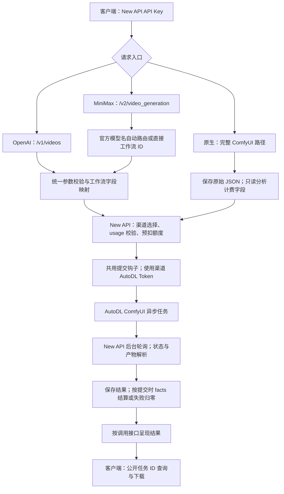

# AutoDL — New API Task Plugin

为 New API 提供 AutoDL.Art Task Plugin 适配，将 AutoDL ComfyUI 工作流接入 New API。

插件 key：`autodl`；显示名：**AutoDL**；当前版本：**v1.0.0**（插件元数据为 `1.0.0`）。

**调用方请先阅读：[完整 API 请求与响应文档](API.md)。** 文档包含三套接口的字段、单图/多图、MiniMax 自动路由、原生透传、查询下载、计费前提和错误处理。

**推荐安装地址：** [https://raw.githubusercontent.com/yiyinfaith/new-api-plugin-autodl/main/plugin.js](https://raw.githubusercontent.com/yiyinfaith/new-api-plugin-autodl/main/plugin.js)

支持：

- OpenAI Video 接口（16 个视频工作流）
- MiniMax 官方 V2 路径和请求格式（两个官方模型名与工作流 ID 扩展值）
- 通过 New API 管理全部 17 个工作流的异步任务
- AutoDL ComfyUI 异步任务
- OpenAI、MiniMax H3 官方风格和 AutoDL 原生三种请求格式
- H3 视频工作流和动作迁移工作流
- indexTTS2 音频工作流
- 后续新增工作流扩展

通过官方 Task Plugin API v1 实现，原有模型名与官网工作流 ID 一致；MiniMax 格式还提供 `MiniMax-H3` 和 `MiniMax-H3-Max` 自动路由。OpenAI 和 MiniMax 在解码层转换；原生请求只做旁路分析并透传原始 JSON。三种格式共用同一套工作流定义、提交、轮询、计费和结果处理。

## 插件如何工作

插件运行在 New API 的任务插件沙箱中。New API 负责验证调用方密钥、选择渠道、预扣额度、保存公开任务 ID、后台轮询与任务归属检查；AutoDL 负责运行 ComfyUI 工作流。客户端只需要提交一次，再使用提交响应中的 New API 任务 ID 查询结果。



OpenAI 解码器将 `seconds / size / input_reference` 等统一字段转换成该工作流实际参数；MiniMax 解码器解析 `content`，根据官方模型名、媒体、时长和比例选择工作流，再使用同一份 `WORKFLOWS` 定义映射。直接传工作流 ID 时保留该工作流能力，官方模型名则先执行 H3/H3-Max 的额外约束。两者会校验业务字段、媒体数量并应用已定义的默认值。

原生入口保存原始 JSON，保持发送给 AutoDL 的 body 在 JSON 语义上完全一致；它只旁路分析时长、分辨率、任务类型和 action。未知非计费字段、数字字符串、嵌套扩展字段不会被重写，缺省值仅用于内部计费。即使原生 body 含有宿主的附件标记同名字段，也按普通业务 JSON 发送。业务参数和媒体有效性由 AutoDL 校验。

三种入口最终共用 `buildSubmitRequest / parseSubmitResponse / buildQueryRequest / parseTaskResult` 及结算、artifact 逻辑。提交时保存 `facts / workflowId / type / submittedAt / timeoutSeconds`，完成时沿用保存的请求用量；AutoDL 的 `data.duration` 是运行耗时，不作为生成秒数。视频工作流成功时选择视频产物，TTS 选择音频；下载产物时不向媒体站点发送渠道 Token。

插件不会自动导入价格、探测远程媒体尺寸或替用户上传本地媒体。MiniMax `adaptive` 使用已确认的工作流默认方向降级，具体限制见 [API 文档](API.md#比例与-adaptive)。上线前请为全部要调用的工作流及官方模型别名配置价格；仅安装插件不足以完成渠道和计费配置。

## URL 安装

**宿主前提：**本插件采用完整的 AutoDL 官方 ComfyUI 路径。未修改的 New API v1.0.0-rc.41 会以 `intersects reserved namespace /api` 拒绝这些路由，因而不能直接加载此最终接口版本。管理员需要先让宿主允许下文的两条精确 ComfyUI 任务路由；针对已核对的 rc.41 源码，仓库提供 [new-api-comfyui-routes.patch](new-api-comfyui-routes.patch)。该补丁只放行对应的 POST submit 和 GET query 声明，其他管理路径、方法、动态路由和通配路由仍被拒绝；原有 Token 鉴权、归属检查、渠道分配和计费处理保持原样。补丁属于宿主适配，不是 `plugin.js` 的运行时依赖。其他 New API 版本请先核对其路由限制，不要直接套用补丁。

宿主补丁对应的源码提交为 `QuantumNous/new-api@2035a82aeb5414253a728bd937d4b8f97aa99b9b`。应用方式是在该源码目录执行 `git apply /path/to/new-api-comfyui-routes.patch`，随后按 New API 原有构建与部署方式更新宿主。该提交的 `VERSION` 文件为空；构建前将其内容设为 `v1.0.0-rc.41`，确保前端与二进制的版本元数据正确，并在部署后核对 `/api/status`。完成宿主适配后，安装只需下列唯一 Raw URL。

1. 登录 New API 管理后台。已验证的 New API **v1.0.0-rc.41** 需要使用 **Root 账户**安装任务插件。
2. 打开「任务插件」，确认任务插件功能已启用。
3. 点击「上传插件」，在弹窗中选择「从 URL 导入」。
4. 粘贴下面的唯一推荐安装地址，并点击「读取 / Fetch」下载源码：

   ```text
   https://raw.githubusercontent.com/yiyinfaith/new-api-plugin-autodl/main/plugin.js
   ```

5. 读取插件信息后，确认插件 key 为 `autodl`、显示名为 **AutoDL**，安装并启用；安装完成后确认 AutoDL 为当前激活插件。
6. 新建渠道，类型选择 **Task Plugin（61）**。
7. 插件显示名选择 **AutoDL**（key：`autodl`）。
8. Base URL 填写 `https://autodl.art`，不要追加 `/api/v1`。
9. 密钥填写 AutoDL **ComfyUI 分组**的原始 Token，**不加 `Bearer `**。
10. 选择需要使用的官网工作流模型，配置模型价格，将渠道分组设为调用端 New API 密钥可访问的分组，再启用渠道。

**必须使用 Raw URL。** [GitHub 仓库首页](https://github.com/yiyinfaith/new-api-plugin-autodl) 是介绍页面，不能直接作为插件源码 URL 使用。上面的 `raw.githubusercontent.com/.../main/plugin.js` 才返回可导入的 JavaScript 源码。

URL 导入在浏览器中下载源码，因此使用管理后台的浏览器需要能访问 `raw.githubusercontent.com`。已验证的宿主版本支持 Plugin API v1、`usageProfiles`、`openai_video` 和 `credentialless` 产物下载；其他实例也需要具备这些能力。

**只需下载 `plugin.js` 即可安装并运行。** 工作流定义、参数映射、插件元信息和任务钩子均包含在这个文件中；不依赖本地 import、Node.js 文件系统或仓库其他文件。`export const meta` 就是官方插件元信息，无需额外 manifest 文件。

仓库只维护根目录的一个 `plugin.js` 和一个当前版本，更新后仍使用同一个 `main` Raw URL。`workflows.json`、`official-workflows.json`、`examples.json` 和 `prices.json` 用于查阅、示例及开发验证，插件运行时不会读取它们；测试脚本、校验文件、许可证和 `.github/` 也不是安装依赖。

更新已有安装时需留意 rc.41 的同版本校验：如果已经安装 `autodl / 1.0.0`，再次导入不同源码会提示 `plugin key and version already exist with different source`。请先备份已有插件源码；该版本未激活时可在任务插件中删除它后重新导入。如果它正在使用，先暂停关联渠道并等待运行中任务结束，再按后台提示删除旧安装、从同一个 Raw URL 导入并启用，最后恢复渠道。本仓库仍只维护 v1.0.0，不需要创建 tag 或选择安装版本。

URL 安装不会自动配置渠道或导入模型价格。请完成上述渠道配置，并为要使用的模型设置价格；未配置价格时可能返回 `model_price_error`。7 个已核实模型的官方价格及表达式见下方价格章节和 [prices.json](prices.json)。

## 支持模型

下面的图片、音频、视频范围表示官网定义的最少数量和最多数量。OpenAI/MiniMax 转换层严格校验媒体数量；原生模式将业务字段及媒体数量交给 AutoDL 验证。完整默认值、枚举、参数上下限和精确尺寸映射见 [workflows.json](workflows.json)。[examples.json](examples.json) 保留根目录工作流 ID 对应的 OpenAI 示例，并在 `_formats.minimax` 和 `_formats.autodl` 中提供全部 17 个工作流的等价示例；原生示例包含 `path` 和 `body`，`_formats.native_passthrough` 另提供省略默认值、数字字符串、未知字段和内部计费 facts 的透传示例；只发送 `body`，不要发送示例中的 `expected_internal_facts`。`_formats.minimax` 另包含两个官方别名示例，`_formats.minimax_scenarios` 提供 15 个路由场景及对应预期工作流；调用时只发送各条目的 `request`。

| 模型名 / 官网工作流 ID | 官网名称 | seconds 范围 | 输入媒体数量 | resolution |
|---|---|---|---|---|
| `minimax_h3_z0903` | H3六图三音频生视频（高质量音画融合） | 1–15 秒 | 图 1–6, 音频 1–3 | 480p/768p/1088p/1440p |
| `minimax_h3_z0902` | H3六图生视频（多图一致性创作） | 1–15 秒 | 图 1–6 | 480p/768p/1088p/1440p |
| `minimax_h3_z0901` | H3文生视频（高质量创意直出） | 1–15 秒 | 无需媒体 | 480p/768p/1088p/1440p |
| `minimax_h3_zm_u24` | H3多图多音频生视频(升级画质) | 1–15 秒 | 图 1–9, 音频 0–3 | 480p/768p |
| `minimax_h3_zm_u08` | H3多图多音频生视频(高速版) | 1–15 秒 | 图 1–9, 音频 0–3 | 480p/768p |
| `minimax_h3_b99_002` | H3首尾帧生成视频 | 1–15 秒 | 图 2–2 | 736p |
| `minimax_h3_b99_001` | H3文生视频 | 1–15 秒 | 无需媒体 | 736p |
| `minimax_h3_b99_003_12s` | H3多图生视频12秒 | 1–12 秒 | 图 1–9 | 736p |
| `wan2.2animate-v4-motion_retargeting` | 动作迁移 | 无时长控制 | 图 1–1, 视频 1–1 | 832p/464p |
| `minimax_h3_image_audio_to_video_v2_15s` | H3多图多音频生视频15秒 | 1–15 秒 | 图 0–9, 音频 0–3 | 480p/768p |
| `minimax_h3_lightx2v_v5_15s` | H3多图生视频15秒 | 1–15 秒 | 图 1–9 | 480p/768p |
| `minimax_h3_image_audio_to_video_v2` | H3多图多音频生视频 | 1–10 秒 | 图 0–9, 音频 0–3 | 480p/768p/1080p |
| `minimax_h3_image_audio_to_video` | H3图生视频-音频同步(自动对口型) | 1–15 秒 | 图 1–1, 音频 1–1 | 480p/768p/1080p |
| `minimax_h3_lightx2v_v5` | H3多图参考生视频 | 1–10 秒 | 图 1–9 | 480p/768p/1080p |
| `minimax_h3_lightx2v_no_pic` | H3文生视频 | 1–15 秒 | 无需媒体 | 480p/768p |
| `minimax_h3_lightx2v` | H3首尾帧生成视频 | 1–15 秒 | 图 2–2 | 480p/768p |
| `indextts2-v1` | indextts2 | 无时长控制 | 音频 1–2 | 无 |

官网 API 定义快照保存在 [official-workflows.json](official-workflows.json)，获取日期为 2026-10-07。全部 17 个工作流定义与指定 7 个模型的价格在 2026-10-08 再次从官网读取核实。未来新增工作流时，添加 `WORKFLOWS` 条目、统一字段映射及测试，不需要修改 New API。

## 渠道与鉴权说明

官方绑定字段是 `setting.task_plugin_key: "autodl"`。插件不声明 `meta.channelTypes: [61]`，该字段用于旧渠道类型，官方禁止用它声明 Task Plugin 类型。

调用端的 `Authorization: Bearer <NEW_API_KEY>` 是 New API 密钥；插件访问 AutoDL 使用 `Authorization: <AUTODL_TOKEN>`，直接读取渠道 `ctx.apiKey`。访问媒体 CDN 时不发送 AutoDL 或 New API 密钥。不要将 Token 写入插件、仓库或示例文件。

OpenAI 和原生格式继续使用官网完整工作流 ID，例如 `minimax_h3_lightx2v_no_pic`。MiniMax 格式还支持 `MiniMax-H3` 和 `MiniMax-H3-Max`；渠道需加入这两个模型，并配置兼容的价格。`MiniMax-H3-MAX` 是额外输入兼容别名，V2 解码时统一为 `MiniMax-H3-Max`，不重复注册模型或要求额外渠道配置。rc.41 允许多个插件共享模型名，选择 AutoDL 渠道时由 AutoDL 执行；如同时存在 Hailuo 渠道，请用渠道分组等现有设置控制调用渠道。可通过 `billing_setting.plugin_billing_expr` 的 `autodl::MiniMax-H3` / `autodl::MiniMax-H3-Max` 单独定价，避免影响其他插件。自动路由只选择上游工作流，不自动导入或改写价格。

## 三种请求格式与入口

| 格式 | 提交入口 | 识别规则 | 返回与查询 |
|---|---|---|---|
| OpenAI | `POST /v1/videos` | 保留现有 `prompt / seconds / size / input_reference / audios / videos / seed` | 原有 OpenAI Video 响应；查询 `GET /v1/videos/{task_id}` |
| MiniMax 官方兼容 | `POST /v2/video_generation` | JSON `model + content + resolution + duration + ratio`；不与 OpenAI 字段混用 | 提交返回 `task_id`；查询 `GET /v2/query/video_generation/{task_id}`，返回官方 `task` 包装 |
| AutoDL 原生兼容 | `POST /api/v1/comfyui/comfyui_workflow/{workflow_id}` | 由独立入口明确选择，body 直接使用官网字段 | 返回公开 `task_id`；查询 `GET /api/v1/comfyui/comfyui_workflow/result/{task_id}` |

**OpenAI 参数格式和原有校验保持不变。** 不通过 `duration`、`resolution` 或 `ref_image_*` 等容易冲突的字段猜测原生格式。三种格式均使用 New API 密钥鉴权、AutoDL 渠道和同一套价格配置。插件注册上述 MiniMax 与原生路径，OpenAI 路径由宿主提供；原生路径只接收原生 body。

如果 New API 域名前置 Cloudflare，请让上面的 API 路径免于交互式人机验证：`/v2/video_generation`、`/v2/query/video_generation/` 前缀，以及 `/api/v1/comfyui/comfyui_workflow/` 前缀。普通 API 客户端无法完成这种浏览器验证，遇到 `403`、HTML 验证页和 `cf-mitigated: challenge` 时应检查 Cloudflare 规则，并与源站响应对比。排除人机验证不改变 New API 的密钥鉴权或任务归属检查；仅按本站域名与这些 API 路径设置规则，不要放开整个管理后台。

## MiniMax 官方兼容 API

实现前核对了 [MiniMax H3 V2 官方创建接口](https://platform.minimax.io/docs/api-reference/video-generation-v2-create) 和 [MiniMax 官方多模态请求示例](https://github.com/MiniMax-AI/MiniMax-H3/blob/main/scripts/readme/full-2k-ref2va-h3-api-2k-in-open-platform-for-reference.sh)。`content` 的媒体 `type` 是 `image_url / audio_url / video_url`，`first_frame` 等是 **role**，不是 type：

| content 项 | 结构 | AutoDL 映射 |
|---|---|---|
| 文本 | `{"type":"text","text":"描述"}` | 该工作流的 `prompt` 或 `prompt_text`；最多一项 |
| 首帧 | `{"type":"image_url","image_url":{"url":"https://…"},"role":"first_frame"}` | `first_frame`，或支持单图的工作流的唯一图片字段 |
| 尾帧 | 同上，`role: "last_frame"` | `last_frame`；仅支持该能力的工作流接受 |
| 参考图 | 同上，`role: "reference_image"` | 按出现顺序映射 `ref_image_*` 或唯一图片字段 |
| 参考音频 | `{"type":"audio_url","audio_url":{"url":"https://…"},"role":"reference_audio"}` | 按出现顺序映射工作流音频槽位 |
| 参考视频 | `{"type":"video_url","video_url":{"url":"https://…"},"role":"reference_video"}` | 按出现顺序映射工作流视频槽位，如 `ref_video` |

省略图片 role 时遵循官方的 `first_frame` 含义；多图参考工作流应明确写 `reference_image`。首尾帧按 role 定位，重复 role、缺少必需帧、超出媒体数量或混合首尾帧与参考媒体都报错。所有媒体仍须公开 HTTP(S) URL，不支持 Base64、文件 ID 或二进制上传。

带分辨率控制的工作流必须提供 `resolution`；`ratio` 按下方官方场景规则处理。直接指定 AutoDL 工作流时，分辨率映射如下：

| MiniMax 风格 resolution | 插件对应 AutoDL 档位 |
|---|---|
| `480P` | `480p` |
| `768P` | `768p` |
| `2K` | `1440p`；仅支持该档位的工作流可用 |
| `1080p`、`1088p`、`736p`、`464p`、`832p` | 保留 AutoDL 特有档位作为扩展值，按具体工作流校验 |

直接指定 AutoDL 工作流时，特有档位也接受完整原始 resolution 枚举标签，例如 `736p横`。参考模式显式指定具体 `ratio` 时，原标签方向必须一致；首尾帧模式或 `adaptive` 则按下方自动方向规则处理。已有 MiniMax 官方名称的档位使用 `480P / 768P / 2K`，不使用小写别名。

支持官方全部 ratio 枚举：`adaptive / 21:9 / 16:9 / 4:3 / 1:1 / 3:4 / 9:16`。场景规则来自 MiniMax 官方 V2 文档，使用官网工作流名和官方模型名时都一致：

| 场景 | ratio 规则 |
|---|---|
| 纯文生：content 只有 text | 必须显式指定具体比例；省略或传 `adaptive` 按官方规则报错 |
| 首帧 / 尾帧 / 首尾帧 | 始终按 `adaptive`；其他合法比例接受后也按 adaptive 处理，遵循官方 i2va 语义 |
| 参考图 / 视频 / 音频 | ratio 可省略，默认 `adaptive`；也可显式指定任一具体比例 |

**单文件插件的 adaptive 降级限制：**当前 New API rc.41 的 Plugin API v1 不提供网络请求或远程图片/视频尺寸探测。仅下载 `plugin.js` 无法测量参考媒体的真实宽高，也不会根据文件名、URL 参数或客户端具体 ratio 假装推断尺寸。因此本适配器接受 adaptive，并按已确认的方案使用所选工作流官网默认分辨率的方向，再在请求档位中选择同方向选项。当前工作流默认方向为竖屏；默认 resolution 档位不会覆盖请求的 resolution。此方案不保证输出与参考媒体真实比例一致，也不是 MiniMax 服务端的尺寸自适应实现。

具体比例映射：`21:9 / 16:9 / 4:3` 选择横屏，`3:4 / 9:16` 选择竖屏，`1:1` 优先选择方形。该分辨率没有方形选项时，降级到官网默认方向。AutoDL 只提供固定横/竖/方档位，插件不额外缩放或裁切，因此 21:9、4:3、3:4 以及缺少方形选项时的 1:1 不保证精确比例；实际像素仍以工作流官方档位为准。分辨率和时长不做降级。

直接使用 AutoDL 工作流名时，`duration`、`audio_duration` 和 `seed` 继续按该工作流原字段与范围校验，保留 1 秒生成及 AutoDL 特有分辨率等能力；不支持的控制明确拒绝，两个时长字段不互相替换。

### 官方模型名自动路由

仅 MiniMax content 格式新增 `MiniMax-H3` 和 `MiniMax-H3-Max`。请求仍为官方字段结构，不需要 `workflow_id` 或其他额外必填字段；OpenAI 和 AutoDL 原生格式不接受这两个别名。

| 外部 model | 官方分辨率 | 官方 duration |
|---|---|---|
| `MiniMax-H3` | `768P / 2K` | 整数 4–15 秒 |
| `MiniMax-H3-Max` | `480P / 768P` | 整数 5–15 秒 |

官方别名请求必须包含一项非空 text，最多 7000 字符。`resolution`、`duration` 仍为必填；调用时优先使用准确的官方大小写：`MiniMax-H3` / `MiniMax-H3-Max`。

| model | 输入内容 / 路由条件 | AutoDL 目标 |
|---|---|---|
| `MiniMax-H3` | 仅 text | `minimax_h3_z0901` |
| `MiniMax-H3` | first_frame + last_frame | `minimax_h3_lightx2v` |
| `MiniMax-H3` | 1–6 张 reference_image，无音频，非 1:1 | `minimax_h3_z0902` |
| `MiniMax-H3` | 1–6 张 reference_image + 音频，非 1:1 | `minimax_h3_z0903` |
| `MiniMax-H3` | 7–9 张 reference_image，或有 reference_image 且 ratio = 1:1；可带音频 | `minimax_h3_zm_u24` |
| `MiniMax-H3-Max` | 仅 text | `minimax_h3_lightx2v_no_pic` |
| `MiniMax-H3-Max` | first_frame + last_frame | `minimax_h3_lightx2v` |
| `MiniMax-H3-Max` | reference_image，无音频，5–10 秒 | `minimax_h3_lightx2v_v5` |
| `MiniMax-H3-Max` | reference_image，无音频，11–15 秒 | `minimax_h3_lightx2v_v5_15s` |
| `MiniMax-H3-Max` | reference_image + 音频，ratio = 1:1，5–15 秒 | `minimax_h3_zm_u08` |
| `MiniMax-H3-Max` | reference_image + 音频，非 1:1，5–10 秒 | `minimax_h3_image_audio_to_video_v2` |
| `MiniMax-H3-Max` | reference_image + 音频，非 1:1，11–15 秒 | `minimax_h3_image_audio_to_video_v2_15s` |
| 两个官方别名 | reference_video | 当前适配器暂无对应 AutoDL workflow，报错 |

方形分支在时长分段前判断：H3 的参考图 `1:1` 请求选择 `zm_u24`，MAX 的图+音频 `1:1` 请求选择 `zm_u08`，5–15 秒均可触发。MAX 无音频的图片任务仍按 10/11 秒分界选 v5 / v5_15s。媒体上限为 9 张参考图、3 段参考音频，具体工作流的必需字段继续严格校验。

自动路由覆盖 11 个不同工作流；`minimax_h3_image_audio_to_video` 继续作为独立直连模型，因此可实际调用到要求的全部 12 个 H3 工作流。indexTTS2、动作迁移和 b99 三个工作流不加入官方别名自动路由，原始工作流名仍能在三种格式中按原有能力调用。

不将 `minimax_h3_image_audio_to_video` 用作官方别名的自动路由目标。单独首帧或尾帧、只有参考音频而没有参考图等官方可能接受的组合，目前没有按本表配置的 AutoDL 目标，会明确报告适配器能力限制，不补图、不猜工作流。

选定工作流仍必须满足请求的质量和时长。例如 `MiniMax-H3` 首尾帧请求 2K 时，指定的 `minimax_h3_lightx2v` 无 2K 档位，明确报错，不降低到 768P；H3 的 7–9 张图或 `1:1` 参考图任务选择的 `zm_u24` 同样没有 2K，因此明确报错。MAX 传 2K 或 4 秒则先按官方模型约束报错。直接填写 AutoDL 工作流名仍可使用该工作流自己的完整能力。

官方模型名示例，统一提交到 `POST /v2/video_generation`：

```json
{"model":"MiniMax-H3","content":[{"type":"text","text":"镜头平稳推进"},{"type":"image_url","image_url":{"url":"https://your-public-file-host.example/reference.png"},"role":"reference_image"}],"resolution":"768P","duration":5,"ratio":"adaptive"}
```

```json
{"model":"MiniMax-H3-Max","content":[{"type":"text","text":"一只猫在雪地中奔跑"}],"resolution":"480P","duration":5,"ratio":"4:3"}
```

New API 的任务记录保留请求的官方别名作为外部模型身份，宿主用 `rewriteModel` 保存实际 AutoDL 工作流用于轮询和用量校验。原有任务提交、计费和结果处理共用同一套钩子，不复制任务逻辑。

为保留 AutoDL 能力，官网额外的非媒体控制可直接作为顶层扩展字段，例如 indexTTS2 的 `emo_control_method / emo_random / emo_calm ...`。不接受文本的图音频同步和动作迁移工作流不应加入 text 项；音频工作流也可用相同 content 结构，这是本插件的 AutoDL 扩展。`prompt / seconds / size / input_reference / audios / videos / orientation` 不与 content 混用，`callback_url`、`extra` 等没有对应 AutoDL 定义的字段也明确拒绝。

### V2 提交和查询

Base URL 填写 New API 站点根地址，密钥使用 New API API Key。无论 `model` 是 `MiniMax-H3`、`MiniMax-H3-Max` 还是 AutoDL 工作流 ID，都使用同一组 V2 路径：

```bash
curl -sS "$NEW_API_BASE_URL/v2/video_generation" \
  -H "Authorization: Bearer $NEW_API_KEY" \
  -H 'Content-Type: application/json' \
  -d '{"model":"MiniMax-H3","content":[{"type":"text","text":"一只猫在雪地中奔跑"}],"resolution":"768P","duration":5,"ratio":"16:9"}'

# 工作流 ID 是 model 扩展值，不改变路径。
curl -sS "$NEW_API_BASE_URL/v2/video_generation" \
  -H "Authorization: Bearer $NEW_API_KEY" \
  -H 'Content-Type: application/json' \
  -d '{"model":"minimax_h3_z0901","content":[{"type":"text","text":"一只猫在雪地中奔跑"}],"resolution":"768P","duration":5,"ratio":"16:9"}'

TASK_ID='提交响应中的task_id'
curl -sS "$NEW_API_BASE_URL/v2/query/video_generation/$TASK_ID" \
  -H "Authorization: Bearer $NEW_API_KEY"
```

提交成功响应仅为 `{"task_id":"task_..."}`。查询使用官方包装和状态，例如：

```json
{"task":{"id":"task_...","status":"succeeded","created_at":1785125529,"updated_at":1785125946,"content":{"url":"https://your-public-file-host.example/result.mp4"},"task_type":"generation","modality":"video"}}
```

状态转换仅发生在 V2 响应层：等待中为 `queued`，处理中和未识别的非终态为 `running`，成功为 `succeeded`，失败为 `failed`。失败任务包含 `task.error.code` 和 `task.error.message`；成功时 `task.content.url` 是公开产物 URL，可直接下载，无需向产物站点发送 New API 密钥。任务 ID 始终使用 New API 的公开 ID；宿主继续执行鉴权和任务归属检查。

**V2 兼容范围：**路径、请求解码、创建响应、查询包装、状态和视频产物 URL 对齐官方。V2 查询优先选择视频，音频工作流则选择音频，不将辅助预览图作为生成结果。rc.41 的公开 `TaskView` 不包含原请求、模型身份、计费事实或私有插件状态，AutoDL 查询的 `duration` 又是处理耗时，因此查询省略无法确认的 `model / resolution / duration / ratio / usage`，不伪造实际视频时长、比例或 token 用量。需要这些元数据的客户端尚不能做到完全替代官方服务。普通的创建—轮询—下载客户端只需替换 Base URL 和 API Key；`callback_url / extra / file_id` 等未实现能力仍明确拒绝。HTTP 参数错误沿用宿主错误结构，不保证与 MiniMax 的错误包装完全相同。音频工作流是 AutoDL 扩展，成功时 `modality` 为 `audio`。

`MiniMax-H3-MAX` 额外别名与 `MiniMax-H3-Max` 的校验和路由完全一致；文档与请求示例优先采用官方拼写。V2 解码器复用已有 MiniMax-compatible decoder，没有复制提交、轮询或计费代码。

## 同一首尾帧任务的三种等价请求

OpenAI，提交到 `/v1/videos`：

```json
{"model":"minimax_h3_lightx2v","prompt":"镜头平稳推进","seconds":5,"size":"480x864","input_reference":[{"image_url":"https://your-public-file-host.example/first.png"},{"image_url":"https://your-public-file-host.example/last.png"}]}
```

MiniMax 官方兼容，提交到 `/v2/video_generation`：

```json
{"model":"minimax_h3_lightx2v","content":[{"type":"text","text":"镜头平稳推进"},{"type":"image_url","image_url":{"url":"https://your-public-file-host.example/first.png"},"role":"first_frame"},{"type":"image_url","image_url":{"url":"https://your-public-file-host.example/last.png"},"role":"last_frame"}],"resolution":"480P","duration":5,"ratio":"adaptive"}
```

AutoDL 原生，提交到 `/api/v1/comfyui/comfyui_workflow/minimax_h3_lightx2v`，body 不加入 model 或统一参数包装：

```json
{"prompt":"镜头平稳推进","duration":5,"resolution":"480p竖","first_frame":"https://your-public-file-host.example/first.png","last_frame":"https://your-public-file-host.example/last.png"}
```

原生调用示例：

```bash
curl -sS "$NEW_API_BASE_URL/api/v1/comfyui/comfyui_workflow/minimax_h3_lightx2v" \
  -H "Authorization: Bearer $NEW_API_KEY" \
  -H 'Content-Type: application/json' \
  -d '{"prompt":"镜头平稳推进","duration":5,"resolution":"480p竖","first_frame":"https://your-public-file-host.example/first.png","last_frame":"https://your-public-file-host.example/last.png"}'

TASK_ID='提交响应中的task_id'
curl -sS "$NEW_API_BASE_URL/api/v1/comfyui/comfyui_workflow/result/$TASK_ID" \
  -H "Authorization: Bearer $NEW_API_KEY"
```

## AutoDL 原生 body 透传与内部计费

原生入口执行 **Native Body Passthrough + New API Sidecar Validation/Billing**。真正发送给 AutoDL 的 JSON body 与客户端原始 JSON **deep-equal**：字段、值、数值与字符串类型、数组顺序、嵌套对象均保留；不删除未知字段、不补默认字段、不改 resolution 文本，不重新生成一份等价 body。这里保证 JSON 语义一致，不保证 HTTP 字节、空白或对象键顺序一致；New API 会解析、序列化 JSON。

插件仅旁路读取原始 body，结合已声明的 workflow 配置计算 `action / type / facts`，并建立和维护 New API task。省略时长、分辨率时，官网 rule 的默认值仅用于内部计费，**不写回上游 body**；情感模式等非计费字段也不会自动补入。`prompt / seed / first_frame / last_frame / ref_image_* / ref_audio_* / ref_video / prompt_text / emo_*` 等业务字段保持原样。未知扩展字段和业务参数有效性由 AutoDL 决定，本地 snapshot 不阻止新增非计费字段透传。

本地严格校验 New API 必须理解的计费内容：

- body 必须是 JSON object，URL 中的 workflow ID 必须是插件已声明的 17 个工作流之一。
- 显式 `duration` 或 `audio_duration` 必须符合该 workflow 的整数类型及上下限；数字字符串可用于分析，但上游仍收到原始字符串。
- 显式 `resolution` 必须是该 workflow 已知的 AutoDL 原始枚举，能映射到内部档位和方向；不接受统一档位或 MiniMax 拼写替代它。
- workflow 没有对应 `duration / audio_duration / resolution` 规则时，显式传入这些计费字段会报无法安全计费；未知非计费字段仍透传。

例如提交 `minimax_h3_z0901`：

```json
{"prompt":"一只猫在雪地奔跑","duration":8,"resolution":"768p横(1344*768)","seed":12345}
```

AutoDL 收到完全相同的 body；New API 内部计算的 facts 是：

```json
{"requests":1,"seconds":8,"resolution":"768p","orientation":"landscape"}
```

如果只提交：

```json
{"prompt":"test"}
```

AutoDL 仍只收到 `prompt`；内部采用该 workflow 默认时长与分辨率计算：

```json
{"requests":1,"seconds":5,"resolution":"768p","orientation":"portrait"}
```

客户端 body 中的 `requests / seconds / orientation / facts / model` 或类似内部字段，不参与覆盖 usage facts 或工作流身份；它们作为原始业务数据隔离保存、透传。插件生成的内部包装、marker、facts 不会额外进入 AutoDL body 或用户响应。提交和提取用量时，插件从保存的原始 JSON 与 workflow 配置重新计算 facts，并校验内部包装的一致性，拒绝伪造计费或交换工作流身份。

修改前原生数据流为 `decodeRaw → normalizeRaw → canonicalRequest → __autodl_fields → normalizeRequest → 重建 AutoDL body`。修改后为 `decodeRaw → 保存原始 JSON + 只读 sidecar → 原始 body 发给 AutoDL → 共用 New API task`，旁路分析提供内部 action 和计费信息。OpenAI、MiniMax 继续原来的转换及自动路由。

提交成功后的 task state 继续保存 `facts / workflowId / type / submittedAt / timeoutSeconds`，沿用现有轮询、结果解析、artifact 和下载逻辑。成功使用提交时保存的 `state.facts` 结算；失败将 `requests` 与存在的 `seconds` 归零。上游 `data.duration` 是处理耗时，不用于视频生成秒数。

官网 `input_example` 中的说明文字是占位说明，需要换成实际参数或 URL；indexTTS2 的数值 `emo_surprised: 0` 也保持原值交给上游。

## OpenAI 统一参数

| 参数 | 类型 | 说明 |
|---|---|---|
| `model` | string | 官网工作流 ID，必填 |
| `prompt` | string | 文本；自动映射 `prompt` 或 TTS 的 `prompt_text`；不接受文本的工作流不应传 |
| `seconds` | integer / numeric string | 秒数；自动映射 `duration` 或 `audio_duration`；按模型校验范围 |
| `resolution` | string | `480p`、`768p` 等统一档位；支持值以模型表为准 |
| `orientation` | string | `portrait` 竖屏、`landscape` 横屏、`square` 方形；按工作流枚举校验 |
| `size` | string | 可选精确尺寸，如 `864x480`；只对已确认尺寸的工作流支持；与上述参数冲突时报错 |
| `input_reference` | object / object[] | 单张参考图用 `{ "image_url": "https://…" }`，多张用同结构对象数组；按顺序映射首尾帧或 `ref_image_*`，严格校验工作流允许的数量 |
| `audios` | string[] | 公开 HTTP(S) 音频 URL；按顺序映射参考音频；TTS 第一段是音色，第二段是情感参考 |
| `videos` | string[] | 公开 HTTP(S) 视频 URL；动作迁移 `videos[0]` 映射 `ref_video` |
| `seed` | integer | 按官网该工作流的种子范围校验；没种子控制的工作流拒绝 |
| `emotion` | object | indexTTS2 情感参数，见下文；其他工作流拒绝 |

省略可选参数时采用该工作流官网默认值。工作流能力不同，统一的是**参数名字**，不代表全部工作流具有相同的分辨率和时长控制。

动作迁移工作流没有 `prompt` 或 `seconds` 控制，时长跟随参考视频；indexTTS2 没有 `seconds`、`resolution` 或 `orientation` 控制，音频时长由文本合成决定。插件会明确拒绝这些不支持的控制。

TTS `emotion.mode` 接受 `voice`（默认，沿用音色参考情感）、`reference`（必须 `audios[1]`）、`vector`（情感向量）。向量参数为 `afraid`、`angry`、`calm`、`disgusted`、`happy`、`melancholic`、`sad`、`surprised`，范围见 catalog；`emotion.random` 是 boolean。官网当前 `surprised` 枚举仅有字符串 `"0"`，本插件接受统一数值 `0` 并转换，拒绝其他值。

JSON 和文本表单均可使用统一参数。表单里的 `input_reference` 单图填写 JSON 引用对象，多图填写 JSON 对象数组；也可重复同名文本字段，每项填写一个 JSON 引用对象，顺序保持不变。`audios`、`videos` 和 `emotion` 仍须 JSON 编码。参考媒体 URL 的过期时间要覆盖任务排队和处理。

## input_reference 与协议限制

已核对当前部署的 New API v1.0.0-rc.41：[Plugin API v1 文档的 Request body / Host protocols](https://github.com/QuantumNous/new-api/blob/2035a82aeb5414253a728bd937d4b8f97aa99b9b/docs/plugin-api-v1.md) 明确支持 `POST /v1/videos` 的 JSON 和 multipart 请求。JSON 对象和数组可原样传给插件；multipart 同名文本字段保留多个值和顺序，同名文件则各自具有独立 `FileReference`。本插件从引用对象的 `image_url` 提取公开 URL，文本表单使用 JSON 编码的引用对象。

[OpenAI 保留的 Videos Create 文档](https://developers.openai.com/api/reference/resources/videos/methods/create) 将 JSON `input_reference` 定义为一个引用对象，包含 `image_url` 或 `file_id`。本插件的**单图输入采用其中的 `image_url` 对象形式**；多图只在此结构基础上扩展为对象数组，通过 New API 透传实现。多图对象数组是 **AutoDL 插件扩展**，不声称 OpenAI 自身的 Videos API 接受多图数组。

- **单图：** `"input_reference": {"image_url": "https://your-public-file-host.example/reference.png"}`；一个元素的引用对象数组也可以。
- **多图：** `"input_reference": [{"image_url": "https://your-public-file-host.example/first.png"}, {"image_url": "https://your-public-file-host.example/last.png"}]`。
- **文生视频和其他无图工作流：** 不传 `input_reference`；即使传空数组也报错。
- **单图工作流：** 必须恰好 1 张。
- **首尾帧工作流：** 必须恰好 2 张，第 1 张映射 `first_frame`，第 2 张映射 `last_frame`。
- **多图参考工作流：** 按数组顺序映射对应的 `ref_image_*`，数量以模型表为准（1–6、1–9，或官网允许图片全部可选的 0–9）。支持 0 张的工作流可省略字段或传 `[]`。
- **数量或类型不合法直接报错：** 不自动补齐、截断或跳过，不接受 URL 字符串、字符串数组、`null` 占位、嵌套数组或混合类型数组。每个引用对象只能包含 `image_url`，其值必须为公开 HTTP(S) URL 字符串；额外字段也会报错。
- 旧 `images` 字段彻底移除：字段一旦出现就报错，空数组也不兼容。所有参考图只通过 `input_reference` 输入。

AutoDL 官网工作流 API 目前明确图片输入是公开 HTTP(S) URL。本插件没有可确认的上游文件上传/转存流程，因此 **不支持二进制文件上传、`file_id` 或 Base64/data URL**。包含 `file_id` 的引用对象会明确报错：`this adapter only supports image_url with public HTTP(S) URLs; file_id is not supported`，即使同时提供 `image_url` 也不接受。需要使用本地图片时，请先上传到可公开下载的存储，再将 URL 放入 `input_reference.image_url` 或对象数组中各项的 `image_url`。

推荐客户端使用 `model`、`prompt`、`seconds`、`size` 和 `input_reference`。`seconds` 接受整数或数字字符串；秒数及精确尺寸仍以 AutoDL 工作流枚举为准，不能直接套用 Sora 的枚举。`resolution`、`orientation`、音频/视频输入和种子等工作流扩展仍保留。

多图也可以使用 multipart 的重复文本字段，每项填写一个 JSON 引用对象；不使用 `@文件`：

```bash
export NEW_API_BASE_URL='https://your-new-api.example'
export NEW_API_KEY='填写NewAPI密钥'
curl -sS "$NEW_API_BASE_URL/v1/videos" \
  -H "Authorization: Bearer $NEW_API_KEY" \
  -F 'model=minimax_h3_lightx2v' \
  -F 'prompt=镜头平稳推进' \
  -F 'seconds=5' \
  -F 'size=864x480' \
  -F 'input_reference={"image_url":"https://your-public-file-host.example/first.png"}' \
  -F 'input_reference={"image_url":"https://your-public-file-host.example/last.png"}'
```

## 调用示例

16 个视频工作流支持标准 `POST /v1/videos`。全部 17 个工作流可使用原生兼容接口，音频工作流通过该接口提交。

```bash
export NEW_API_BASE_URL='https://your-new-api.example'
export NEW_API_KEY='填写NewAPI密钥'
curl -sS "$NEW_API_BASE_URL/v1/videos" \
  -H "Authorization: Bearer $NEW_API_KEY" \
  -H 'Content-Type: application/json' \
  -d '{"model":"minimax_h3_lightx2v_no_pic","prompt":"一只猫在雪地中奔跑","seconds":"5","size":"864x480"}'
```

响应 `id` 是 New API 的公开任务 ID，后续不用 AutoDL 私有 ID。每隔 5–10 秒查询一次，到 `completed` / `failed` 停止，最长 30 分钟：

```bash
TASK_ID='提交返回的id'
curl -sS "$NEW_API_BASE_URL/v1/videos/$TASK_ID" -H "Authorization: Bearer $NEW_API_KEY"
curl -f "$NEW_API_BASE_URL/v1/videos/$TASK_ID/content" -H "Authorization: Bearer $NEW_API_KEY" --output result.mp4
```

成功标准视频响应包含 `url` 和 `results`；公共 ID、状态及时间字段由宿主生成。插件不会编造中间进度，只在成功时报告 100%。

首尾帧（两张图片，顺序为首帧和尾帧）：

```json
{"model":"minimax_h3_lightx2v","prompt":"镜头平稳推进","seconds":"5","size":"864x480","input_reference":[{"image_url":"https://your-public-file-host.example/first.png"},{"image_url":"https://your-public-file-host.example/last.png"}]}
```

图生视频、音频同步（没有文本输入，`seconds` 转为 `audio_duration`）：

```json
{"model":"minimax_h3_image_audio_to_video","seconds":"5","size":"480x864","input_reference":{"image_url":"https://your-public-file-host.example/person.png"},"audios":["https://your-public-file-host.example/voice.wav"]}
```

动作迁移（无秒数、无文本控制）：

```json
{"model":"wan2.2animate-v4-motion_retargeting","resolution":"464p","orientation":"portrait","input_reference":{"image_url":"https://your-public-file-host.example/person.png"},"videos":["https://your-public-file-host.example/motion.mp4"]}
```

TTS 语音合成，通过 AutoDL 原生兼容接口提交：

```bash
curl -sS "$NEW_API_BASE_URL/api/v1/comfyui/comfyui_workflow/indextts2-v1" \
  -H "Authorization: Bearer $NEW_API_KEY" \
  -H 'Content-Type: application/json' \
  -d '{"prompt_text":"你好，这是语音合成测试","prompt_simple":"https://your-public-file-host.example/voice.wav","emo_control_method":"使用情感向量控制","emo_calm":0.3,"emo_random":false}'
```

原生提交的响应字段是 `task_id`；查询：

```bash
TASK_ID='提交返回的task_id'
curl -sS "$NEW_API_BASE_URL/api/v1/comfyui/comfyui_workflow/result/$TASK_ID" -H "Authorization: Bearer $NEW_API_KEY"
```

原生查询保留现有 `task_id / status / progress / fail_reason / results` 响应；成功后 `results` 按顺序包含公开 `url` 和媒体 `type`。用该 URL 下载，不向产物站点发送 New API 密钥。请求 body 无需加入 `model`，工作流身份由 URL 决定；body 中即使出现同名字段，也不会改变内部路由。

## 指定 7 个模型的官方价格

下面每格是 **高峰 / 空闲，人民币元/生成秒**。官网高峰为北京时间 08:00–24:00，空闲为 00:00–08:00。官网内部整数价除以 1000 后得到此金额；[prices.json](prices.json) 包含官方来源与完整 New API 表达式。

| 模型 | 480p | 768p | 1080p |
|---|---|---|---|
| `minimax_h3_lightx2v_no_pic` | 0.03 / 0.02 | 0.04 / 0.03 | — |
| `minimax_h3_lightx2v_v5` | 0.03 / 0.02 | 0.04 / 0.03 | 0.09 / 0.05 |
| `minimax_h3_lightx2v` | 0.03 / 0.02 | 0.04 / 0.03 | — |
| `minimax_h3_image_audio_to_video_v2` | 0.03 / 0.02 | 0.04 / 0.03 | 0.10 / 0.06 |
| `minimax_h3_image_audio_to_video` | 0.03 / 0.02 | 0.04 / 0.03 | 0.09 / 0.05 |
| `minimax_h3_image_audio_to_video_v2_15s` | 0.03 / 0.02 | 0.04 / 0.03 | — |
| `minimax_h3_lightx2v_v5_15s` | 0.03 / 0.02 | 0.04 / 0.03 | — |

这 7 个模型使用 `tiered_expr` 按 `u("seconds")`、`u("resolution")` 和 `hour("Asia/Shanghai")` 计费。例如一个 5 秒 480p 视频，高峰基础价为 ¥0.15，空闲为 ¥0.10。其余 10 个模型未提供本次默认价格，可在 New API 中自行配置。

当前指定实例使用 CNY 展示、`USDExchangeRate=1`，表达式直接填写上述数值，未做外汇换算或加价。其他实例如使用不同展示汇率，应由管理员按站点币种设置换算，不能盲目复制；既有分组倍率仍由 New API 应用。官网价格后续变化不会自动同步，本文件是已核实日期的快照。

每个模型有独立 `usageProfiles`。可控时长视频上报请求次数、请求秒数、分辨率和方向；动作迁移及 TTS 不伪造输出秒数，可先按次配置价格。上游 `data.duration` 是运行耗时，不是视频秒数，绝不用于本插件的按秒结算。完成时沿用保存的请求用量；失败结算次数/秒数归零。宿主时间函数在预扣和结算时计算当前时间，跨 00:00/08:00 的任务可能命中不同时段；AutoDL 公共资料未明确其跨时段判定时点。

## 自动测试客户端

Python 脚本只依赖标准库。真实调用会消耗 AutoDL 余额，先完成渠道和价格配置。

```powershell
$env:NEW_API_BASE_URL = 'https://your-new-api.example'
$env:NEW_API_KEY = '填写NewAPI密钥'
python .\test-video.py --prompt '一个红色小球' --seconds 1 --size 864x480 --out result.mp4
python .\test-video.py --model minimax_h3_lightx2v --prompt '镜头平稳推进' --seconds 1 --size 864x480 --input-reference 'https://your-public-file-host.example/first.png' --input-reference 'https://your-public-file-host.example/last.png' --out reference-result.mp4
python .\test-task.py --format autodl --model indextts2-v1 --request tts-body.json --out result.wav
```

`test-task.py` 使用三种模式各自的提交和查询路径：OpenAI 为 Videos API，MiniMax 为官方 V2，原生为 ComfyUI 兼容 API。提交一次、有截止时间地轮询，再下载产物。OpenAI 模式支持 16 个视频工作流；音频请选原生或 MiniMax 扩展模式。`--example <工作流ID或MiniMax别名>` 配合 `--format openai|minimax|autodl` 可选三种示例，但必需媒体占位 URL 要先换为真实地址。OpenAI 的 `--artifact` 只接受 `video`；MiniMax 接受 `video|audio` 并检查查询的 `modality`；原生接受 `video|audio|image|file`，按 `results[].type` 选择首个匹配产物。无效类型在提交前拒绝，下载不覆盖已有文件。

```powershell
python .\test-task.py --format minimax --request minimax-request.json --out result.mp4
python .\test-task.py --format minimax --example MiniMax-H3-Max --out result.mp4
python .\test-task.py --format autodl --model minimax_h3_lightx2v --request autodl-body.json --out result.mp4
```

原生 `--request` 文件只包含 AutoDL body，模型由 `--model` 提供，不加入 body。连续查询失败五次停止，不覆盖已有输出文件。两个脚本默认 Base URL 是本机 `http://127.0.0.1:3000`，调用远程实例时设置环境变量。

## 错误、轮询与产物

- `QUEUED` → `QUEUED`，`RUNNING` → `IN_PROGRESS`，`SUCCESS` / `completed` → `SUCCESS`，`FAILED` → `FAILURE`。其他状态为 `UNKNOWN`。
- 401/403 检查 ComfyUI 分组和原始 Token；400/422 是参数错误；404/410 是任务或工作流不存在；429 是限流；5xx 是上游服务异常。
- 无效 JSON、成功响应缺少 `task_id`、空/异常 `results`、非法媒体 URL 都会报错或进入失败终态。错误文本中的渠道 Token 会脱敏。
- 重试/后台轮询由 New API 负责。正常排队、运行和未知状态有 30 分钟插件截止时间；不会取消上游任务，也不保证 AutoDL 退款。宿主默认连续轮询错误上限为 20，最终遵循实例配置。
- 单次 HTTP 超时由宿主 `RELAY_TIMEOUT`、`RELAY_RESPONSE_HEADER_TIMEOUT` 控制；插件 API v1 无请求级 `timeout` 字段。插件沿用宿主超时配置；宿主补丁的部署方式另由管理员决定。
- 产物支持 video/audio/image/file，稳定 key 如 `video`、`audio`、`video-2`。音频识别 WAV、MP3、FLAC，视频识别 MP4、WebM。
- `/content` 支持 GET、HEAD 和宿主安全转发的 Range。AutoDL 的 TOS 结果 URL 按 GET 签名，因此插件统一用 GET 请求 CDN；客户端请求 HEAD 时，rc.41 宿主复制响应头后关闭上游正文，只返回响应头。使用 `credentialless: true`，不把渠道密钥发给 CDN；宿主校验目标和重定向。
- AutoDL 结果 URL 有效期较短，代理下载不会延长 URL 有效期。本插件没有自动转存，需要长期保存时及时下载到自己的存储。

## 精确尺寸与需确认项目

`resolution` 档位相同不等于所有工作流的实际宽高相同。例如 z0902/z0903 的 768p 竖屏是 768×1376，z0901 和原文生视频的对应尺寸是 768×1344。尺寸按工作流独立映射，未知尺寸不猜测。

原文生视频支持六个精确 `size`：`480x864`、`864x480`、`480x480`、`768x1344`、`1344x768`、`768x768`。`1280x720` 不在其枚举内，明确拒绝。

**此项需要确认：**动作迁移官网枚举标签为 464×832 / 832×464，内部节点值却为 468/832。插件保留官方选项，通过 `resolution: "464p"` 和方向选择，不承诺精确 `size`。如果必须保证最终像素，需要工作流维护者确认实际输出尺寸或提供真实生成文件信息。

## 验证与官方资料

```bash
node tests.mjs
/new-api plugin lint plugin.js
/new-api plugin test plugin.js --fixture golden.json
```

`node tests.mjs` 执行 **2,253 项检查**并生成 **1,986 个官方 host fixture**。覆盖 OpenAI 与 MiniMax 原有行为、官方别名自动路由、全部 ratio、adaptive 默认方向、错误组合，以及原生 body deep-equal、无默认值写回、未知字段与嵌套参数、数字字符串、计费边界、内部 facts/工作流防伪、task state 和成功/失败结算。上线审计新增宿主附件占位标记旁路、特殊 JSON 自有字段复制和无 type 音频产物的回归检查。前一轮另确认更早的 1,794 个 fixture 保持一致；本轮在 rc.41 实际二进制通过 lint 和 **1,986/1,986 fixture**。

URL 安装已验证：推荐 Raw URL 返回 HTTP 200 和纯文本源码，允许浏览器跨域读取；只下载 `plugin.js`，在应用本仓库 ComfyUI 路由补丁的 rc.41 隔离 New API 实例中通过官方上传接口导入、启用并注册全部 17 个工作流和 2 个 MiniMax 模型别名，随后通过不发送网络请求的 dryrun。单文件目录中没有仓库 JSON 或其他文件，断网 lint 也通过；此验证没有提交 AutoDL 生成任务。

当前插件通过 **155 项隔离 HTTP 检查**，验证使用应用 ComfyUI 路由补丁的 rc.41 镜像、独立 SQLite、模拟 AutoDL，上游参数与原始 Authorization 按全部 17 个工作流、三种格式以及两个官方别名的路由场景逐一断言，覆盖 OpenAI、MiniMax V2 和完整 ComfyUI 原生路由、音频视频产物、辅助图片与视频混合结果、HEAD/Range 下载及错误处理，并验证 MiniMax 参数拒绝、原生计费字段拒绝与业务字段原样透传、单图对象、多图对象数组、multipart 重复引用字段、严格图片数量、旧参考图字段及字符串写法拒绝、`file_id` 的明确报错和不支持的文件输入。本轮在修改前插件复现了原生 JSON 的 `__fileRef` 同名字段被宿主误解析的问题，并通过修复后 HTTP 回归。GET 签名链接的 HEAD 兼容另在已有真实生产任务上验证。`python tests-client.py` 另通过 **19 项离线客户端检查**，不产生网络请求，覆盖三格式提交、查询、下载、音频产物和无效产物类型的提前拒绝。这些模拟测试不产生 AutoDL 费用，不能代替每个工作流真实付费生成的验证。

此前 2026-10-08 生产验证仅提交了一次真实任务：`minimax_h3_lightx2v_no_pic`，1 秒、480p、横屏，成功生成 MP4，New API 记账 ¥0.03。复用同一个任务，源站及公网域名均通过认证 HEAD（200）和 Range GET（206），完整 MP4 下载也通过。本次 MiniMax 官方兼容增强使用模拟测试，没有新增真实生成任务，也未对其余 16 个工作流进行付费生成测试。¥0.03 为此前 New API 的记录，AutoDL 账户余额未另外核对。

- [New API Task Plugin API v1](https://docs.newapi.pro/zh/docs/plugins/api-reference)
- [New API 插件开发指南](https://docs.newapi.pro/zh/docs/plugins/development)
- [New API 官方插件示例](https://github.com/QuantumNous/new-api-plugins)
- [AutoDL ComfyUI API 文档](https://autodl.art/docs/comfyui_api/)
- [AutoDL 官网工作流列表](https://www.autodl.art/large-model/comfyui)

许可证沿用此仓库的 [AGPL-3.0 LICENSE](LICENSE)。
